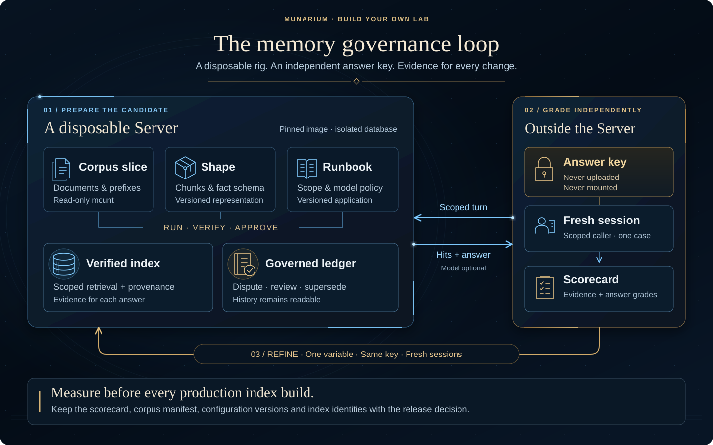

# Build your own AI memory governance lab with Munarium

Every shape and runbook that reaches production should have been measured first, on a copy of
the documents it will serve, against questions whose answers were written down independently.
The developer guide says so at the point where it hands you to production
([dev-guide, "How to read this book"](../../server/docs/guides/dev-guide.md#how-to-read-this-book)),
and [Creating a laboratory for your corpus application](../../server/docs/guides/creating-a-lab.md)
explains the method behind that measurement without a line of code. This guide is the part in
between: the commands, the files and a worked example you can run in about fifteen minutes.

## What a memory governance lab is

Four things, and nothing else is required to start:

| Part | What it is here | Where it is taught |
|---|---|---|
| A disposable Server | The published image, pinned by digest, with its own database, brought up for a run and torn down after | [01-rig-and-corpus.md](01-rig-and-corpus.md) |
| A slice of real documents | A dozen documents chosen to reach every collection binding, laid out under the prefixes your runbook will declare | [01-rig-and-corpus.md](01-rig-and-corpus.md) |
| A shape and a runbook under test | Copied from the nearest sample or materialised by the guided authoring interview, validated, applied, built and approved | [02-shape-runbook-index.md](02-shape-runbook-index.md) |
| A grader that holds the answer key | Client code outside the Server. It opens a session per case, sends one turn, and scores hits and text against expectations the Server has never seen | [03-grading.md](03-grading.md) |

The name says *memory governance* rather than *retrieval* because the same rig measures two
things. The first is whether the right evidence reaches an answer, for the right caller, and
whether the assistant says so when it does not. The second is what the ledger does when two
sources disagree: a contradiction is recorded as disputed, reviewed, superseded, and readable
as it stood at any earlier point. [04-memory-governance.md](04-memory-governance.md) covers that
side, and the worked example grades both.

## The loop

1. **Stand up** a Server for this run only, record its image digest, and prove one write and one
   read.
2. **Load** a slice of the corpus under the prefixes the runbook declares. Keep the answer key
   outside every mount and every prefix.
3. **Apply** the shape, validate and apply the runbook, run it, and approve each cutover after
   reading the build and verify steps.
4. **Grade** with no model first. Evidence grades (which documents were retrieved for which caller)
   need nothing but the index. Then grade answers with a model, per tier you intend to offer.
5. **Change one thing**, publish it as a new version, build again, grade again with the same key
   in fresh sessions. Keep every scorecard.
6. **Release** the tested documents through the hash-verified bundle path, with the record of the
   run that qualified them. Run the same loop before every production index build, not only the
   first.

## Pages

| Page | What you do there |
|---|---|
| [01-rig-and-corpus.md](01-rig-and-corpus.md) | Start a disposable Server with two static tokens and a read-only corpus mount; upload a slice; check extraction; keep the key out |
| [02-shape-runbook-index.md](02-shape-runbook-index.md) | Choose a starting point, validate, apply shapes first, run, approve, confirm the active index |
| [03-grading.md](03-grading.md) | Write the key, understand the graded kinds, run the grader keyless and then with a model, read the scorecard, iterate and release |
| [04-memory-governance.md](04-memory-governance.md) | Walk a planted contradiction through the ledger: disputed, reviewed, corrected, read at a point in time |
| [example/README.md](example/README.md) | The complete sequence over a fictional equipment-support corpus, with the files and scripts |

## Prerequisites

- Docker Desktop in Linux container mode (or any Docker Engine with Compose v2). The published
  image supports `linux/amd64` and `linux/arm64`.
- Python 3.11 or newer for the two scripts in the example. They use the standard library only.
- Optional, for the model-backed grades: a local [Ollama](../../server/docs/guides/ollama.md) or a
  provider key configured per [Managing keys and secrets](../../server/docs/guides/managing-key-and-secrets.md).

## How this relates to the rest of the documentation

- [Creating a laboratory for your corpus application](../../server/docs/guides/creating-a-lab.md)
  is the method: the application brief, the question families, the holdout split, the scoring
  dimensions, the failure diagnosis. Read it once before designing your own key. This guide
  cites it by section rather than repeating it.
- [Getting started](../../server/docs/guides/getting-started.md) is the first-run tutorial the rig
  here is a variation of. If the Server is new to you, run it first.
- The developer guide's Part II is the reference: §16 for prefix and clearance design, §19 for the
  application pattern catalog, §21 for the worked tutorial whose step 8 ("Grade before you ship")
  this guide turns into a script, and §21A/§21B for operating and authoring runbooks.
- [Loading corpora](../../server/docs/guides/loading-corpora.md) and
  [Retrieval sizing](../../server/docs/guides/retrieval-sizing.md) are the operational references
  for the two decisions a lab exists to test.

## Scope

This guide covers Munarium Server. A lab that also measures structured evidence from Munarium
Matrix uses the same loop with `mmctl matrix verify` for the contract side; start from the
[Matrix documentation](../../matrix/docs/README.md) for that half.
