# The operator console

`http://<matrix>/admin` — served by the Matrix binary itself, on the
control role.

An operator can observe, configure and operate a Matrix deployment from a
browser, under the same authority model as the API, **without displacing GitOps
as the source of truth**. That last clause shapes everything below.

## Getting in

```
MUNARIUM_MATRIX_ADMIN=enabled     # the default on `control` and `all`
MUNARIUM_MATRIX_ADMIN=disabled    # every /admin route disappears
```

Open `/admin` and sign in with a **management** token. An rw or ro token is a
valid credential with the wrong role and is turned away; so is a request to a
`query`, `sync` or `reconcile` container, which 404s because the routes are not
mounted there at all.

The threat model, the header set and what the console refuses to render are in
[security/admin-ui.md](../security/admin-ui.md). Two things worth knowing
before you use it:

- **Every write asks for an rw token in the form**, per submission, never
  stored. The console reads on your mgmt credential and acts on your rw one,
  which is the same split `/v1` draws — a leaked mgmt token cannot change what
  the system does.
- **There is no JavaScript on any page.** Everything works with scripting off,
  and everything prints.

## The pages

### overview

What this process is, and whether it agrees with the server it seals into.

The **lockstep** row is at the top on purpose. Anything but `exact` means an
evidence id minted here may not resolve there — which is what a citation like
`[evidence/<id>#r0003]` depends on — so it is the first thing on the first
page and it is badged.

Below it: queue depth with the **age of the oldest job in each state** (a depth
of 3 that is four seconds old is a busy system; a depth of 3 that is forty
minutes old is a stuck worker), activity by journal kind, refusals by **code**
rather than class, and the current hour's budget ledger.

Refusals are counted by code because `budget_exceeded` and `schema_drift` have
completely different remedies, and a page that grouped them by class would tell
you nothing you could act on.

The budget ledger shows **settled, held and released** separately: held units
are in flight, and released ones were refunded because the source was never
reached.

### sources

Registration and posture. **Opening this page causes no outbound traffic** —
reachability is the explicit probe action on a source's own page, because
probing every source on every page view would turn a console into a
traffic amplifier.

A source's page carries its applied YAML verbatim with the hash of the bytes,
its checkpoints (watermark, event position, schema fingerprint) and its recent
sync runs.

### runs

Sync runs across all sources, and every checkpoint.

`records_excluded` is its own column and is never folded into a total: G4 says
a collection states the rows it covers **and** the rows it excludes, and a
console that summed them away would be undoing that.

### journal

Every operation, most recent first, with a refusals-only filter.

Payloads are redacted at write time and this console offers **no reveal**. A
parameter value is customer data; an operator console is the wrong place to
make it readable. Evidence ids are shown and not resolved — that resolver is
the server's and is access-checked per session.

The `via` column says which plane a row came from: `api`, `grpc`, `mcp`, or
`admin-ui` for something you did here.

### verification

Contracts, and the last verification on record for every semantic view.

A semantic view executes only after a passing verification, and that record
carries the **definition fingerprint** an execute compares against — so an
empty table here is not cosmetic, it means those views cannot answer.

"Verify now" appears as a button only where the process also serves the query
plane (role `all`). On a control-only container it is a note naming the role
that serves it, rather than a button that would 404.

### mappings

Per mapping: declared mode, promotion state, the two promotion gates with the
minimums they are measured against, and the latest run.

The gates are **enforced by the API at the moment of the decision**, against
the latest completed run. This page presents them; it cannot promote past one.
A refusal names the gate and the numbers.

Demote stops future writes at the next reconcile poll and touches nothing
already proposed — superseding those is `mxctl mappings rollback`, and the page
says so, because a click that read as "undo" would be a dangerous thing to
believe.

### registry

Every version ever applied, per kind, with the byte hash and the applied time.
Opening one shows its YAML, a **diff against the previous version**, and the
full version list.

Nothing here is editable. An applied version is immutable; a correction is a
new version.

## The configure loop

This is the part that has to justify itself. The server tree deleted its own
`/admin/authoring` pages in August 2026 because a form that ends in a download
served no purpose beside the CLI. That judgement stands, so this loop earns its
place by doing three things a CLI cannot.

**1. Seed a draft from a live introspect.** Pick a source, supply an rw token,
and `/admin/author` fills the textarea with a contract skeleton built from the
tables and columns that source exposes **to its effective principal**. A column
that principal cannot see never reaches the draft. A column whose type canon@1
does not model is listed and *commented out* with the reason — silence would
look like the column does not exist, and you would go looking for it in the
source instead of learning it cannot be used.

The statement, the parameters and the verified questions are left as
`CHANGE-ME`. Generating a plausible-looking statement would be the console
asserting it knows what your contract means.

**2. Validate and diff in one view.** "Validate and diff" posts the draft to
the **same validators** `mxctl validate` runs, then diffs it against the applied
version. A client carrying its own copy of the rules would drift from the
service that enforces them, and the drift would show up as a draft that is
green here and refused there.

Not every finding blocks: three codes are advisory, and the service decides —
not this page.

**3. Then export, or apply in place.** In that order, because the ordinary path
is a commit and a review.

- **Export** gives you the file and a `sha256` manifest to commit. Applying
  that bundle with `mxctl` produces exactly the version you just diffed; that
  equality is what makes exporting the default rather than a formality.
- **Apply in place** needs an rw token **and a decision id** — your record of
  why the repository was not the thing that changed. Afterwards the page says
  the deployment is **drifted from git** until the exported bundle lands, and
  the journal carries the decision id.

Applying in place is legitimate and sometimes necessary. Pretending it did not
happen is not.

**The drift flag, and what clears it** (2026-08-30). Until that day the flag
was a sentence on the apply page — rendered once, persisted nowhere, cleared
by nothing. It is now derived from the journal:
an asset whose **latest** successful apply came in `via: admin-ui` is drifted,
and the registry page, the asset's page and a source's page all say so with
the decision id. It clears when a later apply of the same asset arrives by
any other plane — `mxctl apply` from the landed bundle, CI, the API — which is
the only observable form of "the bundle landed". A re-apply of identical bytes
is `unchanged` and still clears it, because the two paths converging on one
version is exactly the event. Asserted end to end by
`admin.the_drift_flag_sets_on_apply_in_place_and_clears_when_the_bundle_lands`.

## Actions

Each one confirms the write is allowed, resolves the rw credential, runs the
**same `/v1` operation** `mxctl` would, and reports what happened.

| Where | Action |
| --- | --- |
| a source | probe, introspect, sync now |
| a contract | verify now *(query role)* |
| a mapping | run a pass, promote, demote |

`sync` and `run a pass` **enqueue**; they do not run. A sync takes minutes and
belongs to the sync role's queue, so the console hands back job ids and points
at `runs` rather than pretending the click finished the work.

A probe refusal is an **answer**, not an error: "unreachable, and here is the
typed reason" is what was asked for.

## Relationship to the server's console

Two consoles, different halves of one system, linked rather than duplicated.

- **This one** shows Matrix-side facts: sources, queues, syncs, checkpoints,
  budgets, the registry, promotion gates, the journal.
- **munarium-server's `/admin/matrix`** shows server-side facts: sealed
  evidence, hierarchy decisions, the turns that used them.

No crate crosses the tree boundary in either direction — ground rule 1 — which
is also why this console's stylesheet is a *copy* of the server's pattern
rather than a shared crate.

## Screenshots

Produced by the browser tier — `test.ps1 -BlackBox -Browser`, which runs
`ui-smoke/smoke.mjs` (Playwright, dev-only, never in the image) against
compose and writes `images/admin-ui/*.png`. Not made by hand, so a page that
changed and a picture that did not cannot coexist for long; the same script
asserts that every page renders with no `<script>` and that a write submitted
from a real browser, with its real Origin, is answered.

| Page | |
|---|---|
| login | 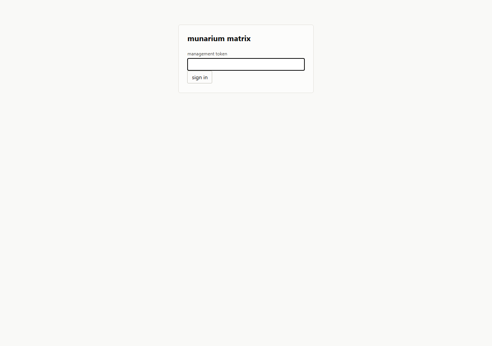 |
| overview | 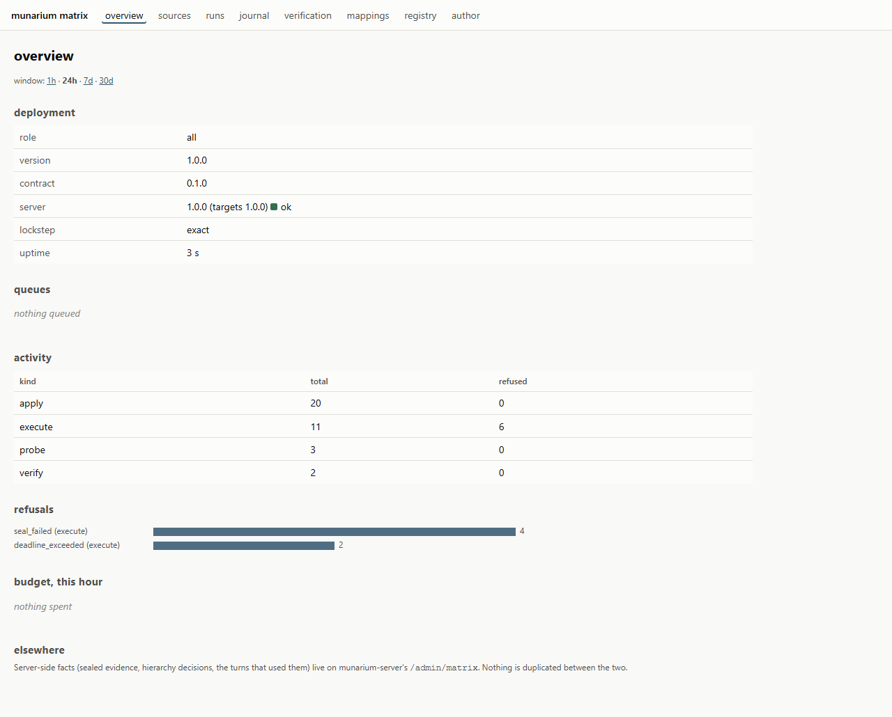 |
| sources | 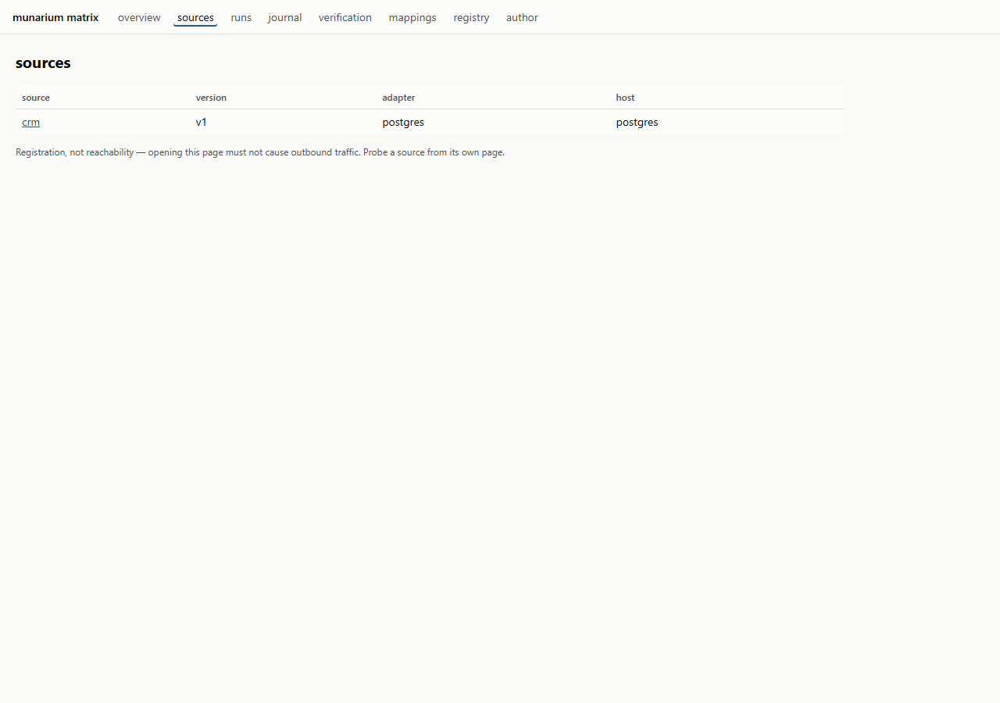 |
| a source | 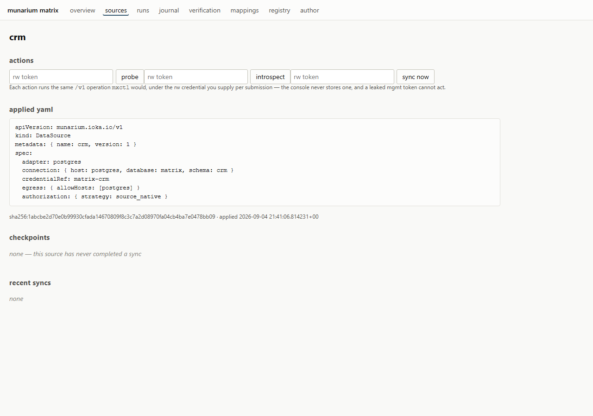 |
| a probe result | 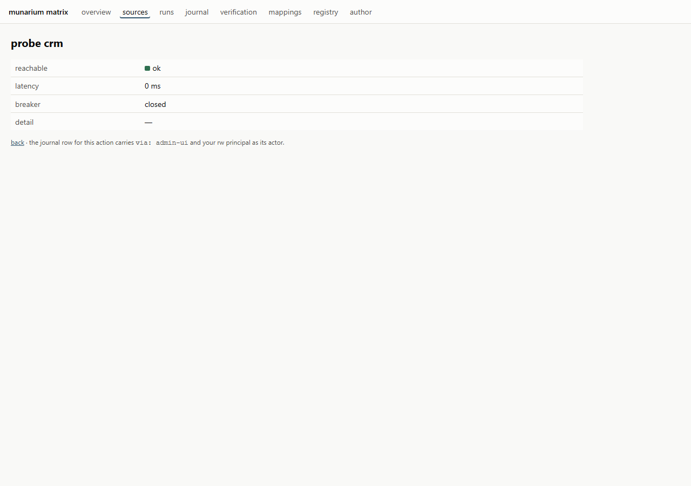 |
| runs | 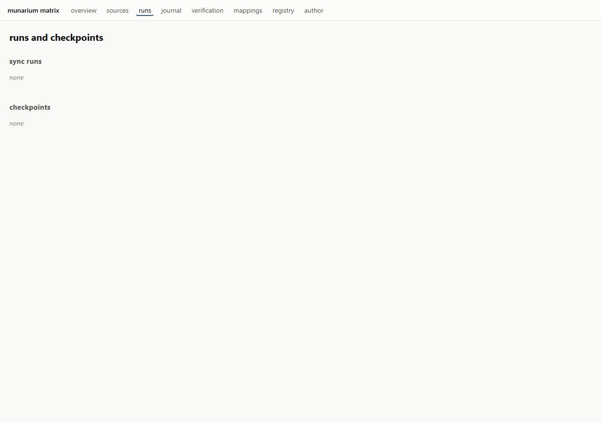 |
| journal | 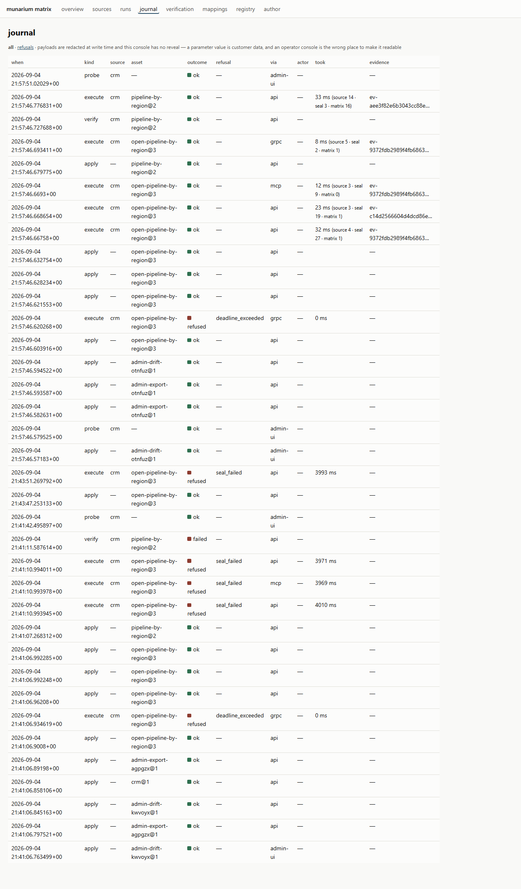 |
| verification | 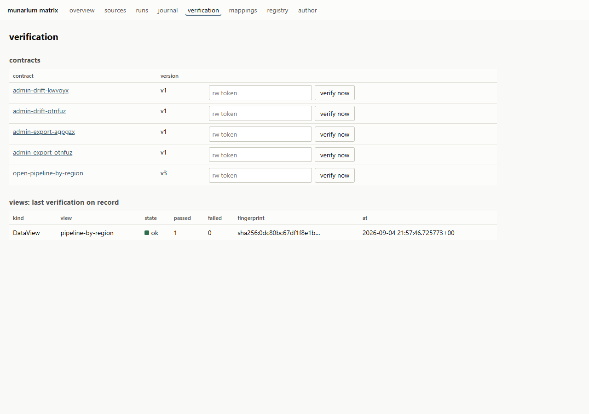 |
| mappings | 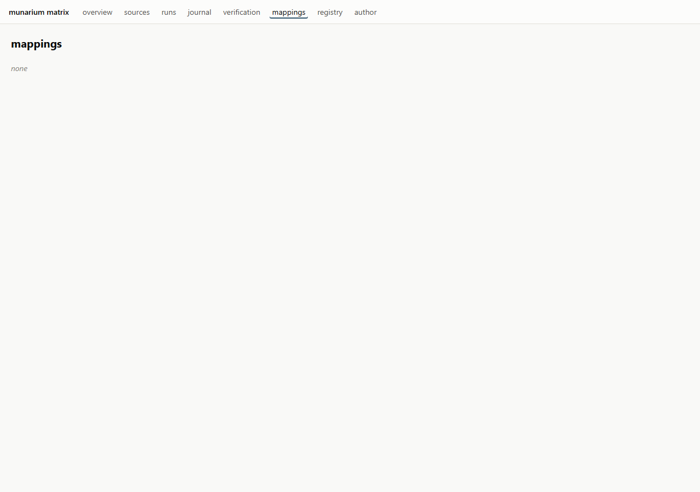 |
| registry | 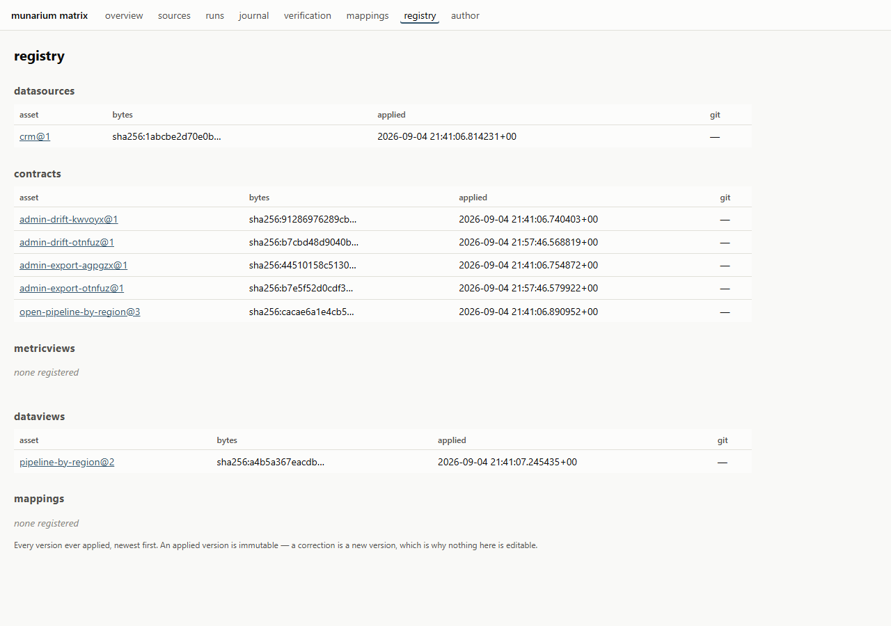 |
| author | 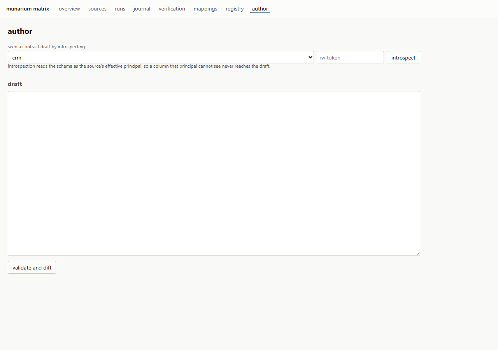 |

## Behind a proxy

A GET-only passthrough — a read-only proxy in front of a showcase deployment,
say — sends
`X-Munarium-Admin-View-Only: 1`. Every action then renders as a note instead of
a button, and a POST that reaches through anyway is refused — so a page that
cannot POST never offers a button that would fail behind it.
