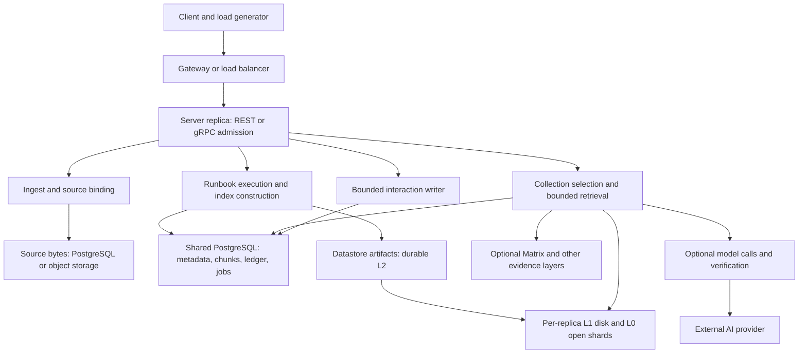

# Measuring and scaling Munarium performance

Measure Munarium as an application pipeline, not as one requests-per-second
number. Uploading bytes, making a corpus searchable, retrieving useful evidence
and producing a verified model answer have different costs and completion
conditions. A faster response is not an improvement if it silently omits documents,
returns poorer evidence or consumes more provider budget than the application allows.

This guide describes the implemented Server paths and telemetry, how to design
repeatable experiments, and where additional capacity or engineering work can
help. It is based on the current repository code and published Server deployment
architecture. Example capacities are planning illustrations, not benchmark results
or promised limits. See [Observability](../observability.md) for the broader
operational/evidence model and [Datastore](datastore.md) for artifact deployment.

## 1. Define the result you want to improve

Use a scorecard with these independent outcomes. Set targets before running the
experiment, including the acceptable error rate and minimum evidence quality.

| Workload | Completion condition | Primary measurements |
|---|---|---|
| Ingestion | Intended documents and bytes are durably stored and correctly bound | Newly stored documents/s, source MiB/s, errors, retries, duplicates, transfer latency |
| Index construction | Intended sources extracted, chunks indexed and verification accepted | Sources/s, chunks/s, build wall time, failed/empty extraction, disk/WAL growth |
| Publication | Approved logical version and artifact are available on serving replicas | Queue wait, verification/promotion time, hydration time, time until searchable |
| Retrieval | Relevant evidence returned from intended collections and pinned indexes | Successful queries/s, p50/p95/p99, recall/ranking, skipped collections, time to first evidence |
| AI query | Complete, policy-compliant answer delivered and recorded | End-to-end latency, successful answers/s, tokens/answer, retries, verification failures, provider cost |
| Mixed traffic | Foreground targets hold while ingestion, indexing and reporting continue | Tail latency, goodput, overload, pool/CPU/disk saturation, backlog growth |

**Goodput** means successful, useful work per second. Keep offered, admitted,
completed, failed, cancelled and timed-out work separate. A batch returning 200
with per-file errors is not a completely successful batch. A run awaiting human
approval has not finished publishing. An AI turn with missing evidence has not
passed merely because the HTTP status is 200.

Measure ingestion-to-searchable latency from document arrival through extraction,
index construction, verification, approval and serving readiness. Report human
approval time separately from machine processing time. Similarly distinguish a
queued build's submission latency from queue wait and execution duration.

## 2. Where time and capacity go



REST and gRPC are two request planes in the same process. Their admission limits
are separate, but they share CPU, memory, PostgreSQL pools and downstream
resources. Datastore is an engine/cache path inside the Server, with optional
separate builder processes; it is not a replacement for PostgreSQL or an
automatically managed standalone retrieval fleet.

PostgreSQL stores the shared state that makes multiple replicas cooperate:
ledger sequencing, idempotency records, registry documents, sessions, runbooks,
artifact catalogs, bindings, build jobs and rollout decisions. Source bytes must
also be shared across replicas. Cloud artifact storage supplies durable L2 while
each replica hydrates its own L1 and opens its own L0 shards.

That architecture supports scale-out, but not unlimited linear scaling. Requests
can still contend on one database, one collection's indexes, one ledger lineage,
one session, storage bandwidth or a provider quota. Measure those shared resources
before deciding that another Server replica is the right intervention.

## 3. What Munarium measures and records today

### Process metrics: live, per replica

The operations listener exposes unauthenticated Prometheus text at `/metrics`,
normally on port 9090. Keep it on an internal monitoring network; for a local
Docker experiment, add this port to the existing Server service and recreate it:

```yaml
services:
  server:
    ports:
      - "127.0.0.1:19090:9090"
```

Do not replace existing REST/gRPC mappings when merging the fragment. A scraper
running in another container can instead use the Server's internal service name
and port 9090. Give **every replica its own scrape target**, rather than scraping
one load-balanced address and treating its alternating counters as one process.

The fixed registry in [metrics.rs](../../src/munarium-server/src/metrics.rs) emits:

| Metric or family | What it measures | Interpretation |
|---|---|---|
| `munarium_build_info` | Build metadata | Record with the image digest and deployment revision |
| `munarium_http_requests_total` | Request outcomes by plane, route template, method and status class | Includes the gRPC plane under the same family; inspect plane/status mapping |
| `munarium_http_request_duration_seconds` | Request duration histogram by plane and route | No success-only label; failures/refusals affect the distribution |
| `munarium_db_pool_connections`, `munarium_db_pool_idle` | Open/idle SQLx connections | Busy connections are their difference, not a pool-wait measurement |
| `munarium_interactions_queue_depth` | Pending audit records | A sustained rise signals the writer is falling behind |
| `munarium_interactions_dropped_total` | Failed nonblocking enqueue, including full/closed queue | Reports may undercount requests during this interval |
| `munarium_interactions_insert_failures_total` | Failed audit inserts | Different from queue overflow; inspect database failures |
| `munarium_load_shed_total` | Admission refusals under concurrency pressure | A capacity signal, not evidence that rejected work completed quickly |
| `munarium_provider_calls_total` | Instrumented completion/embedding operations, by provider/model/kind/outcome | Internal HTTP retries are not separate operations in this counter |
| `munarium_provider_call_duration_seconds` | Instrumented provider operation latency by provider/kind | Includes the adapter operation and its retries; not a per-model histogram |
| `munarium_provider_tokens_total` | Successful completion input/output tokens by provider/model | Not a complete billing ledger; embedding cache hits and embedding token billing are not counted here |
| `munarium_runbook_step_transitions_total` | Transitions by resulting state | Not a per-step duration histogram or completed-document counter |
| `munarium_index_build_total` | Derived-artifact build outcomes by mode/outcome | Not all ordinary PostgreSQL index builds or upload activity |
| `munarium_index_build_chunks_total`, `munarium_index_build_bytes_total` | Work sealed into derived artifacts | Counts artifact work, not original source bytes |
| `munarium_index_build_duration_seconds` | Derived-artifact phase duration: export, seal, publish, total | Phase timing does not include every upstream preparation step or queue wait |

Counters and histograms live in process memory and reset on restart. Gauges are
read from current state when rendered. Persist scrapes externally. Series may
not exist until an operation has occurred; an absent provider metric is not proof
of zero work on every possible model-calling path.

Routes use templates rather than object IDs. Metrics do not add tenant, user or
instance labels; the scraper supplies instance identity. Use reports for tenant
analysis and keep custom dashboard/model label variation controlled. Host CPU,
RSS, container throttling, filesystem utilization, network traffic and PostgreSQL
I/O statistics are **not** supplied by this registry; collect them from the
container/host/database monitoring system.

### Timing boundaries and histogram limits

Client-observed time includes connection setup/reuse, upload, gateway queues,
Server work, response delivery and client parsing. It is the acceptance measure
for an application user. Server timings help explain it; they are not substitutes.

For ordinary REST requests, the interaction's `latency_ms` is captured after the
handler returns and before response-body buffering finishes. The RED histogram
is observed after that buffering. Both start at middleware entry, so they include
request-body buffering but exclude earlier gateway/network delay. Large responses
can therefore make even these two Server measurements differ. Inspect
[middleware.rs](../../src/munarium-server/src/middleware.rs) when comparing planes.

SSE interaction/RED measurements are finalized at stream end, using the terminal
outcome rather than simply the opening HTTP 200. gRPC observes the completed
body/trailer outcome. Measure stream errors, disconnects and unfinished requests
at the client too: completed-request counters cannot describe all outstanding work
during an overload interval.

All built-in duration histograms use the same finite buckets: 5, 10, 25, 50, 100,
250 and 500 milliseconds, then 1, 2.5, 5, 10 and 30 seconds, plus `+Inf`.
This is adequate for many ordinary retrieval timings, but **does not resolve the
tail above 30 seconds**. A long index build or provider call may land entirely
in the overflow bucket. Retain raw client durations and run/job timestamps for
those workloads; do not report a histogram-derived 30-second p99 as a measured
upper bound. Counts and sums still include the longer observations.

### Persisted reports, interactions and execution records

Authenticated reports require the `mgmt` role. They read tenant-scoped shared
PostgreSQL records, so they aggregate activity across replicas:

| Surface | Useful measurements |
|---|---|
| `/v1/reports/timeseries?window=1h&plane=rest` | Request/error volume and stored latency p50/p95 over time |
| `/v1/reports/endpoints?window=1h&plane=rest` | Operation counts, errors, average and p95 latency |
| `/v1/reports/usage` | Usage grouped by supported user/session/runbook/collection dimensions |
| `/v1/reports/cost` | Completion tokens recorded on session turns, grouped by resolved provider/model |
| `/v1/reports/budgets` | Reserved/settled daily token use and remaining policy allowance |
| `/v1/reports/runbooks`, `/v1/reports/sessions`, `/v1/reports/evidence` | Workflow/session activity and evidence-layer outcomes/timing |
| `/v1/reports/audit` | Request IDs, identities, operation, status, latency and bounded request/response evidence |
| `/v1/runs/{run_id}` | Persisted execution and step state/details, including approval boundaries |
| `/v1/index-build-jobs/{job_id}` | Queue/worker state, attempts, result and error |
| `/admin/storage` | Datastore effective mode, capabilities, fleet/cache observations and shadow counters |

Time-series windows are `1h`, `24h`, `7d` and `30d`; use the
[REST/OpenAPI reference](../api/rest.md) for each report's filters. Usage, cost
and audit support explicit time bounds. Keep queries narrow during a load test:
report aggregation itself consumes the same PostgreSQL resources being measured.
Do not poll every dashboard page at high frequency as a substitute for scraping.

The interaction writer has a fixed 1024-record channel and one task per process,
inserting one row at a time. It does not block requests when the channel fills;
it drops records and increments a counter. Failed inserts are counted separately.
On the memory backend it logs/discards instead of persisting. The body capture
limit (`MUNARIUM_INTERACTION_BODY_MAX`, default 32768 bytes) controls stored body
detail, not the HTTP request-buffer limit or queue length. Larger/non-JSON bodies
are summarized with hashes and lengths, and designated secret responses are redacted.

Consequently, report counts are eventually visible and best-effort under pressure.
Wait for queue drain before a final report snapshot, and record dropped/failed
insert deltas. Do not treat stored reports as a complete denominator for overload,
authentication rejection or client timeout rates. Capture those at the client and
gateway and compare against process counters.

Session turns persist query, hits, envelopes, completion and hierarchy data.
Successful completion records aggregate the normal completion retries' token
counts. The cost report reads those session-turn records; it does not include
every direct provider request, failed/disconnected operation, embedding bill or
operator diagnostic. `/healthai` makes paid model calls through a separate probe
path and is not an ordinary readiness check. Reconcile usage with provider billing
before making dollar claims. See [Managing keys and secrets](managing-key-and-secrets.md).

## 4. Build a useful monitoring view

For local inspection, fetch the exposition without dumping configuration or keys:

```powershell
$metrics = (Invoke-WebRequest 'http://127.0.0.1:19090/metrics').Content
$metrics -split "`n" | Where-Object {
    $_ -match '^munarium_(http_requests_total|db_pool_|interactions_|load_shed_total)'
}
```

In Prometheus, select only the intended scrape job/environment. The examples
below assume you named that scrape job `munarium`. These expressions aggregate
replicas while preserving the route and plane where needed:

```promql
# Completed request rate, split by result class.
sum by (plane, status_class) (
  rate(munarium_http_requests_total{job="munarium"}[5m])
)

# Estimated fleet p95 by route; aggregate buckets before taking the quantile.
histogram_quantile(0.95,
  sum by (le, plane, route) (
    rate(munarium_http_request_duration_seconds_bucket{job="munarium"}[5m])
  )
)

# Request rate exceeding the last finite bucket, by route/plane.
sum by (plane, route) (
  rate(munarium_http_request_duration_seconds_count{job="munarium"}[5m])
)
-
sum by (plane, route) (
  rate(munarium_http_request_duration_seconds_bucket{job="munarium",le="30"}[5m])
)

# Audit loss and overload over the measurement window.
sum(increase(munarium_interactions_dropped_total{job="munarium"}[5m]))
sum(increase(munarium_interactions_insert_failures_total{job="munarium"}[5m]))
sum(increase(munarium_load_shed_total{job="munarium"}[5m]))
```

Run each expression separately. Use `rate`/`increase` to handle counter resets;
do not subtract arbitrary raw samples across a restart. Never average replica
p95s or combine p95s from different windows. Quantiles from buckets are estimates;
use raw observations for precise tail analysis. These are standard
[Prometheus histogram aggregation rules](https://prometheus.io/docs/practices/histograms/).

Alongside latency/throughput show admission refusals, audit loss, queue depth,
pool open/idle, PostgreSQL waits and connection count, container CPU/throttling,
RSS, disk free space, disk latency, network transfer and provider outcomes/tokens.
Add backlog age/count from build jobs and source/index completeness from the
application. A single green latency chart cannot reveal whether work is being
dropped or accepted faster than it can be indexed.

Use structured logs (`MUNARIUM_LOG_FORMAT=json`, with an appropriate `RUST_LOG`
filter) and record `x-munarium-request-id` at the client. Correlate slow/failing
samples with audit rows, run IDs, collection/index versions and the correct
replica. Current tracing is not an end-to-end exported OpenTelemetry span tree;
your gateway/application instrumentation must supply its own outer timing.

For PostgreSQL, have the DBA observe connections, wait events, locks, I/O, WAL,
checkpoints and vacuum activity. Where installed, `pg_stat_statements` identifies
expensive normalized SQL by calls, total/mean execution time and rows. It requires
server configuration; it is not installed automatically by this guide. I/O timing
fields require the appropriate timing configuration. See
[PostgreSQL's statistics documentation](https://www.postgresql.org/docs/16/pgstatstatements.html).
Use query plans on representative staging data; `EXPLAIN ANALYZE` executes its
statement and should not casually be applied to production mutations.

## 5. Design a repeatable performance experiment

### Fix the workload and environment

Record the image digest/source revision, enabled engines, CPU/RAM and Docker/VM
limits, storage type and capacity, database version/extensions/settings, replica
count, connection/admission limits, region/network path, and monitoring overhead.
For a Windows workstation, include Docker Desktop's Linux VM resource allocation
and distinguish Windows bind mounts from Linux named-volume storage.

Version the corpus manifest, document counts/bytes/media types, extraction outcomes,
chunk counts/length distribution, collections and index versions. Record shape and
runbook versions, retrieval parameters, Datastore artifact bindings, model/provider
selection and completion policy. Changing chunking can increase chunks/s by making
smaller chunks while reducing useful document throughput; retain both measures.

Use representative small, median, large and difficult documents, including PDF/OCR
cases if the application uses them. For retrieval, include frequent and rare
terms, multi-collection questions, answerable/unanswerable queries, authorization
variants, pinned historical versions and realistic session histories. Keep an
independent quality key outside the indexed corpus, as in [Creating a lab](creating-a-lab.md).

### Separate experiments before mixing them

Run this sequence so each additional component has an attributable cost:

1. **Single-operation baseline:** one upload, one build, one retrieval, one turn.
   Confirm correct results and metric/report visibility before generating load.
2. **Ingest only:** store/bind known files; keep index construction out of this
   interval and count newly stored bytes separately from duplicate skips.
3. **Index only:** build from an already stored corpus; measure extraction,
   database maintenance, artifact publication and activation separately.
4. **Retrieval only:** `complete: false`, with model-based query expansion disabled
   in the runbook as well. Disabling completion alone need not eliminate all model
   calls. Compare PostgreSQL, mirror, shadow and Datastore deliberately.
5. **AI completion:** use the same evidence workload with a pinned provider/model,
   context size, output ceiling and retry/verification policy. Measure actual calls
   and spend; a local stub is useful for load isolation but not a provider benchmark.
6. **Mixed traffic and recovery:** sustained foreground queries during ingest,
   index work, report reads, a rolling restart and artifact hydration.

Repeat with warm and cold conditions explicitly named. Distinguish a cold Server
process, empty L0, empty L1, database buffer-cache state and upstream provider
cache behavior. Recreating a container does not necessarily cold-start its named
volume, the operating-system page cache or PostgreSQL. Never drop production
caches or delete artifacts to manufacture a cold benchmark.

### Increase load without hiding overload

Use bounded client concurrency first to locate bottlenecks, then a scheduled
arrival-rate test to confirm the desired offered rate under load. A closed-loop
client waits for each result before offering more work, so it slows down when
the Server slows down and can conceal queueing pressure. An arrival-rate tool
such as k6 can separate arrivals from response time; record scheduled versus
started work and dropped iterations too. See the
[k6 open/closed workload model](https://grafana.com/docs/k6/latest/using-k6/scenarios/concepts/open-vs-closed/).

At each load step, wait for stabilization, then collect a steady-state interval
long enough to include checkpoints, cache churn, report writes and provider rate
windows relevant to that test. Repeat runs and publish sample counts, not just a
p99. A few dozen observations cannot establish a stable production tail. Retain
timeouts/cancellations as outcomes rather than deleting them from the dataset.

Measure from a generator with spare CPU/network capacity, ideally on another
machine for deployment benchmarks. Record connection reuse, TLS, request/response
sizes, retries and client timeouts. Keep one user's turns sequential within a
session; use many sessions/users for concurrent conversations. A shared-session
stress test is a separate contention experiment, not a typical traffic model.

Use stop conditions: excessive error rate, falling quality, audit loss, disk
headroom, growing backlog, unacceptable database waits or the model budget.
Report the highest **sustained** load that meets all targets, with operational
headroom, rather than the largest instantaneous burst accepted before collapse.

## 6. Large-scale ingestion and indexing

### Upload efficiently and measure the right bytes

Munarium provides single-file ingestion, batches and resumable manifest-based
bulk uploads. The bulk manifest supports up to 100,000 files, with at most 500
files per chunk. `mmctl bulk upload` defaults to 400 files and 140,000,000 raw
bytes per chunk, with `--chunk-files` and `--chunk-bytes` controls. These are
packaging limits, not server-side parallel worker counts. The current CLI sends
chunks sequentially; files within a submitted batch/chunk are processed in a loop.

Use manifest/status/complete to distinguish needed, stored, skipped-existing and
failed files, resume only outstanding work, and verify final hashes/bindings.
Manifest bookkeeping uses SQL groups of 5,000 rows; this is an implementation
batch size, not an environment setting. Raw upload throughput and per-document
processing efficiency must both be measured across realistic file sizes.

Document-carrying REST routes have a 256 MiB body ceiling; ordinary routes use
the smaller ordinary-body limit. JSON/base64 requests include approximately 4/3
encoding expansion plus JSON overhead, so a 256 MiB raw file does not fit in a
256 MiB JSON request. Request buffering, decoding and copies also consume memory.
Smaller bounded chunks can outperform very large requests when retries, competing
queries and memory pressure are included. See
[ingest_api.rs](../../src/munarium-server/src/ingest_api.rs) and
[body limits](../../src/munarium-server/src/rest.rs).

Start with a small number of independent upload streams and increase only while
useful byte throughput improves. Avoid simultaneous writes of different contents
to the same logical filenames. Measure source-store round trips, database binding
work and error/retry amplification before increasing frontend concurrency. For
large source collections, shared object storage can move document-byte traffic
off PostgreSQL; the database still owns metadata and coordination.

### Distinguish index construction paths

The ordinary collection-index path uses per-collection PostgreSQL partitions
with lexical GIN and vector HNSW indexes. It already batches chunk inserts in
groups of 200 with an array/`unnest` statement. It uses the local hash embedder
for this path; do not estimate its throughput as if every chunk called an AI
embedding API. Other provider-backed paths must be measured separately.

The ordinary build still performs source fetch, extraction, local embedding and
chunk insertion within a transaction spanning the collection build. Slow document
storage or OCR can therefore keep a connection/transaction occupied for a long
time. After building it performs partition maintenance with `VACUUM (ANALYZE)`;
measure through completion of maintenance and verification, not just the last
insert. Inspect [collections.rs](../../src/munarium-retrieval-pg/src/collections.rs).

The direct-build path deliberately extracts/prepares outside the insertion
transaction, then commits prepared chunks and builds the derived artifact from
the prepared work. It avoids the long extraction transaction, but accumulates
prepared chunks in memory. This exchanges one resource constraint for another;
measure peak RSS and the largest collection, and validate its logical identity,
embedding and artifact semantics before adopting it. See
[direct.rs](../../src/munarium-retrieval-pg/src/direct.rs) and the
[Datastore build workflow](datastore.md#5-backfill-and-verify-existing-indexes).

Normal runbook execution is ordered, with one executor per run protected by a
PostgreSQL advisory lock. `execution.order: collectionMajor` can reach a cutover
gate after each collection instead of building every collection before the first
gate under `stepMajor`. It changes request/approval boundaries; it does not
parallelize the build. Measure approval wall time separately and partition work
into operationally manageable collections without losing retrieval coverage.

Durable Datastore jobs decouple job submission from long execution. Each enabled
worker process runs one claimed job at a time and heartbeats its lease; multiple
worker processes can claim independent work. Add workers gradually while measuring
database connections, staging disk, source bandwidth and CPU. More workers do not
make one serialized collection build run in parallel, and queued jobs do not
automatically rewrite the ordinary runbook execution path.

Record at least: source bytes accepted, unique documents, extraction failures,
chunks committed, queue wait, extraction/build/maintenance wall times, sealed
artifact bytes, publication/verification time and first successful query against
the approved version. The built-in artifact phase histograms complement this
record; they do not replace missing ordinary-index or extraction phase timings.

## 7. High-volume retrieval

Session retrieval prepares the query, may probe candidate collections, searches
selected collections with bounded fan-out, fuses results and constructs evidence.
`retrieval.searchConcurrency` defaults to 4 and is validated from 1 through 16.
The semaphore is per fan-out operation, not a global database admission controller.
Prepared query/vector work is shared across the fan-out, and results retain
deterministic ordering despite concurrent completion.

With `Q` simultaneous turns and `C` searches allowed per turn, potential concurrent
search demand can approach `Q × C`, before other pool users. Raising both client
concurrency and `searchConcurrency` can therefore just move the queue into the
database pool. The per-collection timer starts after the fan-out semaphore is
acquired; it does not include time waiting for that semaphore. Compare the whole
turn's time, not only the sum or average of measured child searches.

Tune in this order, retaining the quality key:

1. Confirm collection bindings, index readiness and permissions; fix skipped or
   empty collections before optimizing timings.
2. Bound unnecessary fan-out with appropriate collection routing/selection, then
   measure the overhead and recall effect of the probe stage itself.
3. Tune `candidateN`, `topK`, matching and fusion for the corpus. More candidates
   increase database/search work and merging; fewer can discard needed evidence.
4. Tune `searchConcurrency` against actual pool headroom and concurrent turns.
   Measure p95/p99 and throughput, not only a single fast query.
5. Compare PostgreSQL with Datastore using identical prepared queries and pinned
   logical versions, including warm, cold and mixed-build workloads.
6. Size Datastore L0/L1 from the working set, including historical pinned versions.
   Validate exact versus approximate vector recall and cold hydration separately.

`completion.contextCharBudget` governs how much retrieved text is sent to the
model. Reported hits can exceed the text that fits into context; lowering the
budget may reduce model latency while silently removing the evidence needed for
an answer. Similarly, many tiny collections can improve isolation but increase
probe fan-out and cache churn. Use [Retrieval sizing](retrieval-sizing.md) as a
corpus-specific method, not as a universal instruction to maximize every knob.

If the runbook uses Matrix or another evidence layer, measure that dependency
separately as well as through the Server turn. Distinguish source query time,
materialization/freshness, evidence verification and orchestration. A fast
document-search result says nothing about a slow governed data query. Evidence
reports expose layer outcomes/timing; use the dependency's own service/database
telemetry to investigate below that boundary.

## 8. AI query throughput and streaming

Model calls often dominate wall time. Increasing Server replicas cannot exceed
the provider's request/token quotas or eliminate model reasoning/generation time.
Track tokens per successful answer, completion attempts, provider failures,
verification outcomes and context size alongside answer latency.

The provider adapter uses a 10-second connect timeout and a 300-second request
timeout. Its bounded HTTP retries handle retryable responses, with up to two
retries on the normal adapter paths and bounded `Retry-After` sleeps. These are
code-level defaults, not Datastore query-timeout settings. One operation can
span multiple wire requests; the operation counter is not a network-attempt count.

A session may also call a model for query expansion. A truncated/empty completion
can trigger one re-ask at four times the original output ceiling, and configured
quote/citation verification can trigger corrective completions. Measure the
actual enabled chain and token totals rather than estimating each user turn as
one provider call. Do not reduce output ceilings until reasoning-heavy responses
become empty and then describe the faster failures as an optimization.

Provider RPM/TPM budgets are per-process windows split using
`ceil(configured_limit / MUNARIUM_REPLICA_COUNT)`. This approximates shared
limits; rounding, uneven load and restarting a process affect the result. Daily
tier token reservations use shared storage, but explicit-model completions
without a tier bypass the daily tier cap. Embeddings and diagnostic calls have
different accounting paths. Use provider-side limits and observe actual spend
in addition to Server policy. See [Token budgets](../tokenbudgets.md).

Cached embeddings are per process, so new replicas begin cold; hits are excluded
from the real embedding-call counter. Completion records do not imply that
every provider-billed token is present in the reports, especially for failures
or calls outside session completion. Record the provider's usage export for paid
benchmarks and attach a dated pricing calculation outside the Server.

SSE exposes phase-progress events and the final turn outcome; it is not evidence
that provider tokens are streamed as they are generated. Measure time to headers,
first progress, first useful evidence and final answer separately. Receiving
progress sooner improves responsiveness but does not increase completed answers/s.
The current streaming handler can continue executing and persisting after a client
disconnects, so a timed-out client does not prove downstream work or spend stopped.
Avoid immediately retrying such a turn as if no work happened.

For many simultaneous conversations, use bounded admission, sensible client and
gateway deadlines, fair per-tenant request policies and explicit provider budgets.
Keep sufficient CPU/pool capacity for metadata/reporting while model calls wait.
Stage retries with backoff/jitter at the application boundary, respecting Server
and provider refusal semantics, rather than creating synchronized retry bursts.

## 9. Scale the service using measured bottlenecks

| Control | Implemented behavior | How to tune and validate |
|---|---|---|
| `MUNARIUM_MAX_CONCURRENCY` | Default 512, minimum 1; separate REST/gRPC ceilings per replica | Raise only if CPU, memory, pool and downstream capacity have headroom; count 503 overload and stream lifetimes |
| `MUNARIUM_DB_MAX_CONNS` | Default 10, minimum 2; SQLx pool per replica | Include all API/worker instances, locks, admin/monitoring and migration connections in the database budget |
| `MUNARIUM_REPLICA_COUNT` | Default 1; enables shared-store validation and divides provider rate windows | Set to the intended participating replica count; it does not start replicas or discover autoscaling changes |
| `MUNARIUM_REGISTRY_TTL_SECS` | Default 15 seconds | Measure configuration convergence after rollout; 0 is load-once behavior and unsuitable for changing multi-replica registries |
| `MUNARIUM_SHUTDOWN_GRACE_SECS` | Default 20 seconds | Coordinate drain/readiness and orchestrator termination grace; test long builds and streams explicitly |
| `MUNARIUM_INSTANCE_ID` | Unique process identity from configured/host fallback | Identify every replica in logs and persisted records; do not assign one ID to all workers |
| `retrieval.searchConcurrency` | Per-turn bounded fan-out, default 4 | Tune with concurrent turns and pool capacity, rather than in isolation |
| Datastore cache, worker, shadow and retention settings | Per-process storage/work controls plus shared catalog/rollout | Use the complete [Datastore reference](datastore.md#3-complete-environment-reference) |

For database connection planning:

```text
sum(pool limits of every API and worker process)
  + concurrently executing runbook advisory-lock connections
  + monitoring, migration and administrative reserve
  < PostgreSQL connection capacity available to this deployment
```

Four replicas at pool limit 20 already reserve potential demand for 80 pooled
connections; this is not a complete budget for a database capped at 100. Each
active runbook execution holds an additional detached advisory-lock connection.
High idle count does not imply high useful throughput, and near-zero idle count
does not by itself distinguish healthy utilization from pathological waiting.

Use `concurrent work ≈ completed work/s × mean time in system` as a steady-state
sanity check. For example, 20 answers/s taking 5 seconds on average implies about
100 simultaneous answers before retry overhead. This is not a reason to set the
admission ceiling to exactly 100: burst tolerance, service-time variance and
downstream constraints still need measurement.

Scale up when the measured bottleneck is per-process CPU, memory or cache capacity.
Scale out when independent work can use more replicas without saturating shared
resources. Separate builder and reader workloads operationally when build CPU,
disk or database use harms foreground targets. Keep the same logical data and
appropriate deployment/fleet configuration across them.

The current cluster supports multiple instances with one PostgreSQL database;
it does not supply automatic tenant/database sharding, read-replica routing,
pgcat/PgBouncer configuration or a universal autoscaler. A connection pooler must
be evaluated against the session-level advisory locks before deployment. External
autoscaling should consider backlog, request latency, CPU/pool pressure, provider
quotas and cold hydration, while maintaining the intended replica-count policy.
Consult [Clustering](../ops/clustering.md) for shared-state and recovery contracts.

## 10. Where improvement may be valuable

These are evidence-based engineering candidates, not claims of unimplemented
bugs or promises that each change will help every workload. Establish a baseline,
implement one change, and require correctness and quality to remain intact.

| Candidate | Current constraint/evidence | Measurement that would justify the work |
|---|---|---|
| Longer or workload-specific duration histograms | Shared buckets end at 30 seconds | Material overflow for provider/build workloads; improved tail visibility after change |
| Phase/queue-wait instrumentation | No complete stage trace for upload, extraction, pool waits, ordinary builds or each provider wire retry | Unexplained end-to-end time or backlog that current metrics cannot attribute |
| More efficient interaction persistence | Fixed 1024-entry queue and one-row inserts per process | Sustained queue growth, drops or database write cost; compare batching/durable buffering with foreground latency |
| Bounded streaming buffers and cancellation propagation | SSE uses unbounded channels and work may continue after disconnect | Slow/disconnected clients increase memory or abandoned provider work; preserve terminal audit semantics |
| Bounded parallel extraction or staged preparation | Ordinary collection builds serialize source processing in a long transaction; direct builds retain prepared chunks in memory | Source/OCR waits, long transactions or high RSS dominate large builds; preserve deterministic identity and atomic activation |
| Improved bulk transfer scheduling | Sequential CLI chunks and per-chunk file processing | Spare server/storage capacity with a saturated single uploader; compare bounded streams and retry amplification |
| Adaptive/fair query admission | Per-plane request limits and per-turn fan-out do not reserve capacity by tenant/workload | Heavy users/builds degrade other tenants' p95 despite adequate aggregate capacity |
| Shared provider-rate coordination | Replica-split local windows approximate cluster limits | Provider 429s or unused quota under imbalance/autoscaling; compare accuracy and coordination overhead |
| Reduced database/report contention | Reports, coordination and many search paths share PostgreSQL | Slow aggregate reports or locks correlate with foreground tail latency; evaluate indexes, aggregation or service placement |
| Retrieval/cache/fusion improvements | Candidate counts, approximation, fan-out and cache working sets are corpus dependent | Better held-out recall/latency frontier, not merely lower milliseconds on a tiny warm corpus |

Source locations for reviewing these candidates include
[interactions](../../src/munarium-server/src/interactions.rs),
[session retrieval/streaming](../../src/munarium-server/src/sessions_api.rs),
[provider adapters](../../src/munarium-providers/src/lib.rs),
[provider instrumentation](../../src/munarium-server/src/providers_api.rs),
[collection indexing](../../src/munarium-retrieval-pg/src/collections.rs),
[direct preparation](../../src/munarium-retrieval-pg/src/direct.rs),
[jobs](../../src/munarium-server/src/datastore_jobs.rs) and
[reports](../../src/munarium-server/src/reports_api.rs).

## 11. Use the repository benchmark for the question it answers

The repository includes an ignored, manual
[PostgreSQL-versus-Datastore benchmark](../../src/munarium-retrieval/tests/benchmark_baseline.rs):

```powershell
# Run from server/ with MUNARIUM_TEST_DATABASE_URL supplied privately.
if (-not $env:MUNARIUM_TEST_DATABASE_URL) { throw 'Configure an isolated benchmark database first' }
cargo test -p munarium-retrieval --test benchmark_baseline --release -- --ignored --nocapture
if ($LASTEXITCODE -ne 0) { throw 'Benchmark failed' }
```

It creates a fresh benchmark tenant, loads 400 synthetic documents, builds an
index/artifact and measures prepared-query execution side by side. It reports
cold artifact hydrate/open/first-query time separately from warmed repeated-query
percentiles. It skips when the database variable is absent; a skipped measurement
is not evidence of performance. Use a disposable database: benchmark rows persist
even though temporary artifact directories are removed at test completion.

This answers an engine-level comparison question. It does not measure HTTP/gRPC
overhead, gateway load, bulk-upload throughput, production-scale corpus quality,
multi-replica serving, cloud object latency or AI provider response time. Do not
turn its relative speedup into a general Munarium capacity claim. Keep the raw
output, environment and dataset identity, and run the application workload as well.

## 12. Publish a performance result someone else can reproduce

For each candidate/baseline pair, retain:

- Build/image identity, topology, resource limits and complete non-secret settings.
- Corpus/query manifests, shape/runbook/index/artifact versions and quality keys.
- Offered/admitted/completed/good work, errors, timeouts and retry counts.
- Latency distributions and raw sample counts, with warm/cold conditions and stages.
- Queue/backlog changes, audit loss, CPU/memory/disk/network/database observations.
- Provider/model usage, retries, dated cost calculation and budget enforcement notes.
- Ingestion/index completeness, retrieval quality and answer-verification results.
- Restart, concurrent-build and rollback outcomes, plus untested conditions.

Compare like-for-like intervals and retain failed runs. If quality, audit coverage,
offered load or topology changed, explain the difference rather than describing
all timing movement as a speed improvement. Use the evidence to set a sustainable
capacity envelope and alerts, then remeasure when corpus size, model, deployment
shape or query mix changes.

Related guides: [Observability](../observability.md), [Clustering](../ops/clustering.md),
[Datastore](datastore.md), [Getting started](getting-started.md),
[Loading corpora](loading-corpora.md), [Retrieval sizing](retrieval-sizing.md),
[Creating a lab](creating-a-lab.md), [Token budgets](../tokenbudgets.md),
[Managing keys and secrets](managing-key-and-secrets.md),
[Deployment](../ops/deployment-runbook.md), [REST reference](../api/rest.md) and
[Server configuration](../../README.md#configuration-env-vars).
