# Munarium pull-request history: working outline

**Status:** outline for a later full history. Not normative; the code, changelogs and API
references remain the source of truth.
**Covers:** every merged pull request in `iokaio/munarium`, #1 and #16–#46
(5–24 September 2026, UTC merge dates). Numbers #2–#15 were used by issues, not pull requests.
**Sources:** each PR's description, commit headlines and changed-file list, with a few
merged-source spot checks where a diagram needed precision.
**Reviewed:** 24 September 2026 against merged main `680dbe3` and public PR records.
PRs #47–#49 are open and appear separately below; neither an open PR nor a merge
is evidence of a published release. Era grouping is thematic, not strict merge order.
**Written for:** the future technical architect, and a VCP contributor who needs to know how
the Server reached its current shape before changing it.

Each entry records **what** changed, **why**, the **files** that carry it, what an
architect should **take from it**, and whether a **diagram** helps. Diagrams live in
[images/](images/).

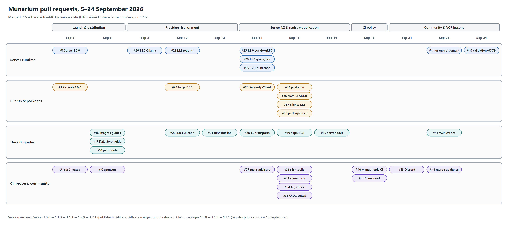

---

## Era 1 — Launch and distribution (5–6 September)

### [#1](https://github.com/iokaio/munarium/pull/1) Initial import: Munarium 1.0.0 (server, matrix, clients) — merged 2026-09-05

- **What**
  - One commit bringing in 947 files: `server/` (Rust governed-memory service, 20 crates),
    `matrix/` (structured-evidence plane, 14 crates), `clients/` (seven official libraries:
    Server clients in Rust, Python, .NET and Java; Matrix clients in Python, .NET and Java).
  - Apache-2.0 throughout: SPDX headers on required source files, LICENSE/NOTICE inside every built
    package, `TRADEMARK.md`, DCO sign-off with no CLA, and `check_license.py` proving it over
    both source and built artifacts.
  - Six CI workflows: repo hygiene, server, Matrix, Matrix↔Server contract, clients, DCO.
    All run on hosted runners; no live cloud tiers.
- **Why**
  - The design came from a long private R&D period that was deliberately left out. The goal
    was a repository that can be evaluated, built, contributed to and released on its own,
    with automatic validation under the configured workflow triggers and path filters.
- **Architectural ground rules established here** (keep these in view for everything after)
  - The Server is the governance authority. Its ledger is append-only with supersession
    chains; a blocked claim is recorded `disputed`, never dropped. Every answer carries a
    provenance envelope.
  - Matrix never calls a model provider, never writes a Server table, and never issues
    DDL/DML against a customer source. An unsupported adapter combination is a typed
    refusal. The analytics-platform adapters are Enterprise-only and not in this tree.
  - Contract discipline: the MMP protos, REST reference and OpenAPI documents are normative.
    Generated copies are drift-checked and never hand-edited (Python stubs, OpenAPI JSON,
    gRPC reference, the vendored `server/contract/matrix` with its `contract.lock`).
  - Compatibility commitments: additive-only migrations, wire N/N−1 policy, and a stable
    `MUNARIUM_*` configuration contract. `clients/compatibility.json` is the authoritative
    version and support record.
  - Nothing private: a private-material scan with reasoned exceptions, gitleaks over tree and
    history, and generated third-party notices.
- **Files:** `.github/workflows/*`, `check_license.py`, `server/**`, `matrix/**`,
  `clients/**`, `CONTRIBUTING.md`, `.gitleaks.toml`.
- **Diagram:** yes, the component architecture and gate set at import.
  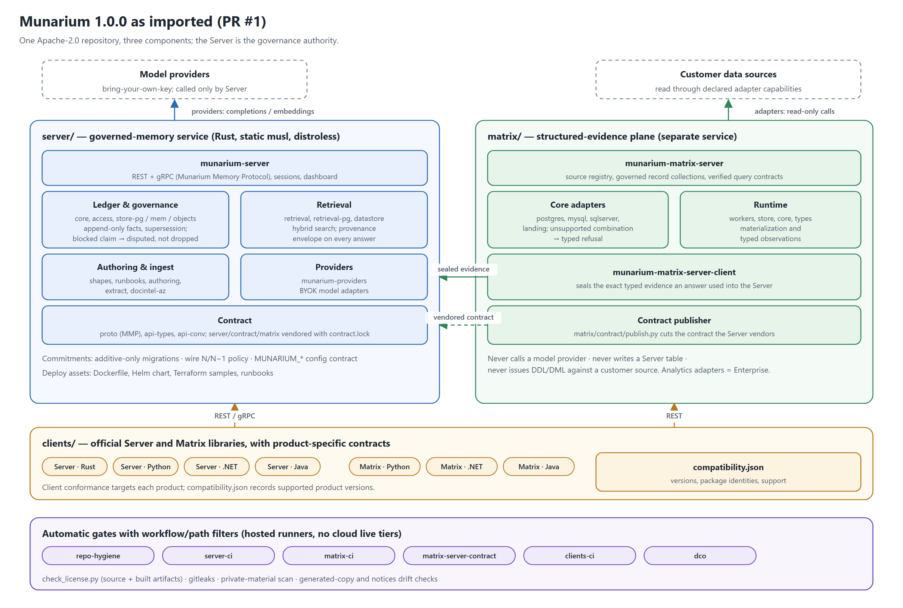

### [#16](https://github.com/iokaio/munarium/pull/16) Publish multi-platform Server images and add deployment guides — merged 2026-09-06

- **What**
  - The container build moved from AMD64-only to AMD64 + ARM64, with Rust pinned to 1.98.0,
    locked dependencies, per-architecture caches, and static-link verification for the
    Server and `mmctl`.
  - OCI labels (source, revision, version, license); licence and notice files inside the
    nonroot distroless image; BuildKit SBOM including the locked dependency inventory.
  - New guides: `server/CONTAINER.md`, `getting-started.md`, `creating-a-lab.md`
    (method only, no code), `managing-key-and-secrets.md`; a large developer-guide expansion
    (Docker Hub walkthrough, backup/restore, upgrade/rollback, troubleshooting).
  - Routed the Matrix↔Server contract job to an 8-core runner group (reverted to standard
    runners in #40).
- **Why**
  - Public docs assumed a source build, and there was no documented path from pulling an
    image to running a persistent corpus.
- **Takeaways**
  - The PR records an "execute the docs" habit: its new PowerShell and YAML guide
    blocks were run against the published image. This outline summarizes that evidence.
  - The v1.0.0 release tag stayed at its original source commit, so the image's recorded
    source identity and attestations remained true after the history squash.
- **Files:** `server/Dockerfile`, `server/rust-toolchain.toml`, `server/CONTAINER.md`,
  `server/docs/guides/*`, `README.md`.
- **Diagram:** yes, the release path that #16, #20, #26, #28 and #29 build up between them.
  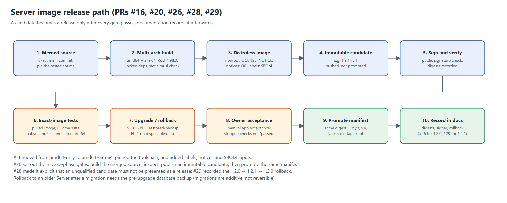

### [#17](https://github.com/iokaio/munarium/pull/17) Document Datastore deployment, configuration and operations — merged 2026-09-06

- **What**
  - New `server/docs/guides/datastore.md` covering all 22 `MUNARIUM_DATASTORE_*` variables,
    Compose and Kubernetes examples, local/S3/Azure Blob/GCS artifact storage, cache sizing,
    retention, the staged/shadow/serving bindings, prewarm, promotion, readiness and
    rollback.
  - Corrected existing references: `pg` is not an artifact backend; retention defaults to
    twice the derived horizon; direct vector builds approximate at or above the threshold.
- **Why**
  - Datastore operation was spread across several documents, some of them wrong.
- **Takeaways**
  - The Datastore is a serving engine, not an authority: PostgreSQL still holds the ledger,
    catalog and bindings. Logical identity (`index_version_id`) is separate from physical
    identity (`artifact_id`), so an engine upgrade does not move session pins.
  - The operational blocks were executed against the 1.0.0 image. Cloud examples were
    checked against code only, and the PR says so.
- **Files:** `server/docs/guides/datastore.md`, `server/docs/ops/mmctl.md`,
  `server/docs/architecture.md`.
- **Diagram:** yes, the storage layers and binding-slot lifecycle.
  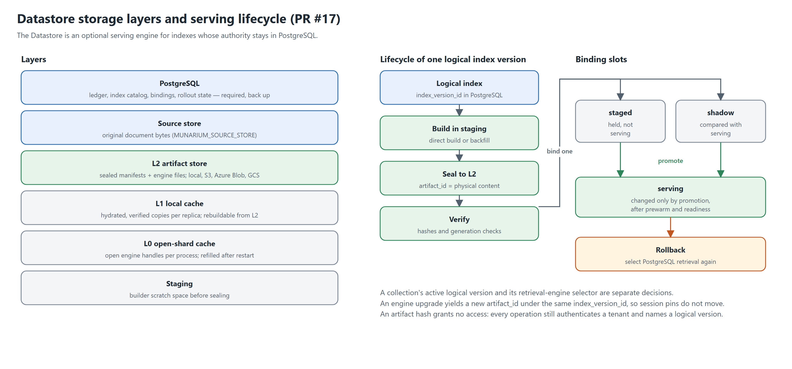

### [#18](https://github.com/iokaio/munarium/pull/18) Document performance measurement and scaling — merged 2026-09-06

- **What:** new `measuring-performance.md` covering the scaling architecture, telemetry and
  reporting boundaries, workload design, tuning controls, and bottleneck-driven engineering
  opportunities. Also corrected the histogram range and REST timing boundaries in
  `observability.md`.
- **Why:** operators needed a code-based method for measuring sustainable capacity across
  ingestion, indexing, retrieval and AI queries.
- **Takeaways:** it defines "useful throughput" (correct answers with evidence quality) as
  distinct from accepted requests. The example capacities are illustrations; no benchmark was
  run. This thread returns in the VCP roadmap (P07, P13).
- **Files:** `server/docs/guides/measuring-performance.md`, `server/docs/observability.md`,
  `server/docs/ops/clustering.md`.
- **Diagram:** no. The guide's own content is the reference.

### [#19](https://github.com/iokaio/munarium/pull/19) Enable GitHub sponsorship — merged 2026-09-06

- **What:** added `.github/FUNDING.yml`. **Why:** open a funding channel for the project.
- **Diagram:** no.

---

## Era 2 — Providers, routing and alignment (8–12 September)

### [#20](https://github.com/iokaio/munarium/pull/20) Add Ollama provider support for Server 1.1.0 — merged 2026-09-08

- **What**
  - Native Ollama chat and embeddings (not the OpenAI-compatible endpoint that issue #8
    proposed), with explicit endpoints, optional local auth, installed-model health checks,
    and named or explicit-family routing over REST and gRPC.
  - Credentials became optional for this provider; cloud providers are unchanged.
  - Pinned Docker Desktop evaluation stack (`server/deploy/ollama/`), contract tests, and an
    `ollama.md` guide. Server 1.1.0, Helm chart 0.2.0.
- **Why:** local and credential-free model use, and a reproducible local qualification
  path (Qwen3 1.7B, all-minilm) that later releases reuse.
- **Constraints recorded:** MMP wire major stays 1; no migration; index construction
  still uses the local embedder; completions are non-streaming with thinking disabled; no
  tool execution.
- **Takeaways**
  - Release discipline became explicit: build the exact merged source for both
    architectures, run inspection gates, publish an immutable candidate, then promote the
    same manifest to `1.1.0`, `1.1` and `latest`, keeping the `1.0` tag.
  - A 1.0.0 → 1.1.0 → 1.0.0 upgrade/rollback was rehearsed on disposable data.
- **Files:** `server/src/munarium-providers/src/ollama.rs`, `providers_api.rs`,
  `server/proto/mmp/v1/provider.proto`, `server/deploy/ollama/*`.
- **Diagram:** covered by the release-path diagram under #16.

### [#21](https://github.com/iokaio/munarium/pull/21) Fix session model override routing for Server 1.1.1 — merged 2026-09-10

- **What:** a per-turn provider/model/tier override now applies to query expansion as well as
  answer generation. Invalid or disallowed overrides are rejected before any provider call.
  Retrieval-only turns still reject non-empty overrides.
- **Why:** expansion was silently using the runbook default, so one turn could involve two
  models, and the chosen tier did not govern expansion cost or latency.
- **Takeaways:** "validate before spending" becomes a Server principle; it reappears in
  #28 (routing owned by operator config) and #44 (budget settlement). Regression tests use
  real loopback provider calls and assert zero calls on rejection.
- **Files:** `server/src/munarium-server/src/sessions_api.rs`, `sessions_model_tests.rs`.
- **Diagram:** yes, before/after.
  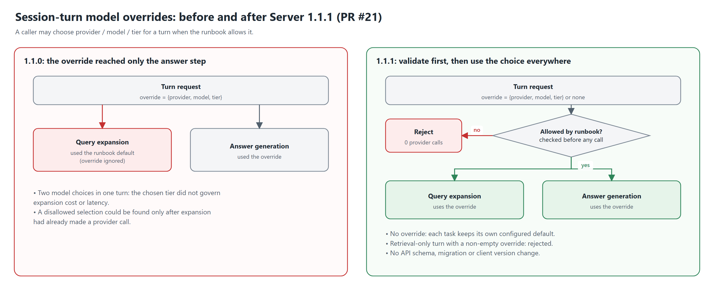

### [#22](https://github.com/iokaio/munarium/pull/22) docs: align guidance with current code and published artifacts — merged 2026-09-10

- **What:** 28 Markdown files corrected:
  - separated the published Server 1.1.1 image from the Matrix/client source version 1.0.0;
  - replaced registry install instructions (no packages existed yet) with source installs;
  - stated that the direct gRPC listener is plaintext and the advertised TLS variables were
    not implemented; fixed Helm image/secret wiring and selectors;
  - corrected Matrix role counts and separated core from Enterprise adapters.
- **Why:** the documentation described intentions and mixed versions, not the shipped state.
- **Takeaways:** this starts a recurring pattern (see also #26, #30, #39, and P04 in #46):
  docs claims are checked against the code and published artifacts, and dated history is kept
  in place instead of rewritten.
- **Diagram:** no.

### [#23](https://github.com/iokaio/munarium/pull/23) Align client libraries with Munarium Server 1.1.1 — merged 2026-09-10

- **What:** the Server clients target Server 1.1.1 while keeping the 1.0 minor baseline and
  package version 1.0.0. Rust wire-crate requirements moved to 1.1.1. The compatibility
  checker now validates Server ranges separately from Matrix. Added a disposable
  qualification stack with an Ollama-protocol fixture (`clients/python/conformance/*`).
- **Why:** the clients still advertised 1.0 after two Server releases. No transport change
  was needed, because the existing transports already carried the fields.
- **Takeaways:** the compatibility record is now machine-checked per product line. Live
  results were recorded per language (Python, .NET, Java, Rust), and skips were named rather
  than hidden.
- **Diagram:** no.

### [#24](https://github.com/iokaio/munarium/pull/24) Add a runnable guide to building an AI memory governance lab — merged 2026-09-12

- **What:** `docs/lab/`, four guides plus a worked example:
  - twelve fictional equipment-support documents across four prefixes, one of them a
    restricted engineering collection;
  - a digest-pinned 1.1.1 Compose stack, shape, runbook, optional Ollama provider;
  - an answer key kept outside every mount, and stdlib Python `lab.py` and `grade.py`.
  - Also added `scripts/docs_linkcheck.py`, which enforces root and `docs/` links plus an
    index rule, and runs in repo hygiene.
- **Why:** closes issue #15. `creating-a-lab.md` explained the method without code; teams
  needed something they could run.
- **Takeaways**
  - The grader mints a scoped capability token per case, opens a fresh session, and grades
    evidence and answer separately. Restricted-path leakage is a hard failure (proven by
    deliberately granting clearance and expecting exit 1).
  - The ledger grade checks corrections, disputed claims, point-in-time reads and conflict
    findings: governance is tested separately from retrieval.
- **Diagram:** one already exists in `docs/lab/images/`.
  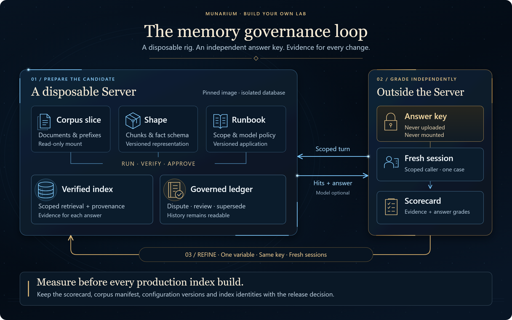

---

## Era 3 — Server 1.2 and registry publication (14–16 September)

### [#25](https://github.com/iokaio/munarium/pull/25) Server 1.2: collection vocabularies and verified file references — merged 2026-09-14

- **What**
  - Collection vocabularies owned by the Server: generation (on by default, with configurable
    sampling, media-type balancing and excerpt budgets), revision-checked management, and query
    expansion, through additive `/v1.2` APIs. Manual edits and disabled collections are
    preserved.
  - Answers: one model-generated narrative with verified, pinned source references. The
    ingesting application still authorizes and serves the original files.
  - Complete transport coverage: all 117 documented REST operations get named native RPCs in
    `mmp.v1.ServerApiService` and methods in a generated `ServerApiClient` for Rust, Python,
    .NET and Java (package version 1.1.0). Dispatch goes through the same in-process handlers
    (authorization, limits, audit). JSON nulls and 64-bit integers survive both transports.
  - Migrations 0032 (chunk provenance) and 0033 (collection vocabularies). Extraction
    locations flow through PostgreSQL and Datastore; citations keep the indexed hash after a
    source update.
- **Why:** move query-shaping knowledge out of every application and into the Server, and
  close the gap between the REST surface and gRPC/SDK coverage.
- **Takeaways**
  - The generator pattern (`scripts/generate_server_api.py` from `openapi.json` to seven
    outputs, with `--check`) makes transport drift a build failure.
  - New locations require a fresh index build (indexes are immutable). Rollback to an older
    Server requires the pre-upgrade database backup.
- **Files:** `vocabulary_api.rs`, `answers_api.rs`, `grpc_api.rs`,
  `grpc_api_generated.rs`, `server_api.proto`, `munarium-retrieval-pg/src/provenance.rs`,
  `migrations/0032*`, `0033*`, `clients/server-api.json`, the SDK `server_api*` files.
- **Diagram:** yes, the operation inventory and generation flow.
  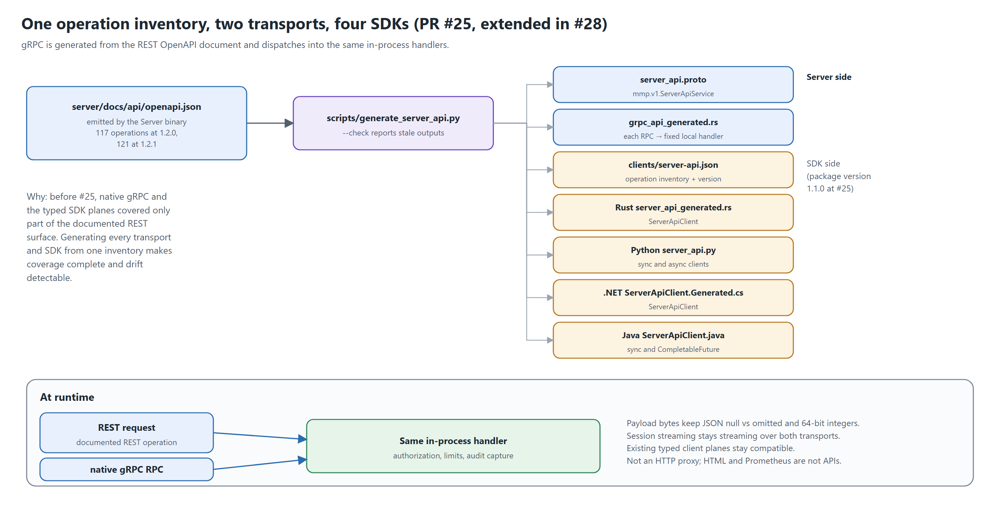

### [#26](https://github.com/iokaio/munarium/pull/26) Document Server 1.2 transport support and release verification — merged 2026-09-14

- **What:** removed the remaining "REST-only" claims; distinguished the historical typed
  client planes from the complete `ServerApiClient`. The Ollama acceptance harness now
  takes an explicit expected version. Recorded the signed 1.2.0 digests, signer identity and
  exact-image qualification.
- **Why:** release records must name exactly what was verified, without weakening version
  assertions.
- **Diagram:** covered by the release-path diagram under #16.

### [#27](https://github.com/iokaio/munarium/pull/27) Update rustls to address RUSTSEC-2026-0285 — merged 2026-09-14

- **What:** rustls to 0.23.45 in the Server, Rust client and Matrix lockfiles; three
  notices regenerated.
- **Why:** a failing `main` Server CI run (cargo-deny) surfaced the advisory.
- **Takeaways:** fixed at the source with no suppression. The security fix was kept separate
  from the unpublished 1.2.1 work.
- **Diagram:** no.

### [#28](https://github.com/iokaio/munarium/pull/28) Server-owned collection answers and publication governance for 1.2.1 — merged 2026-09-14

- **What**
  - `POST /v1.2/query` takes the unchanged question, a collection scope and an optional
    governing date. The Server enforces clearance, scope, publication state and effective
    dates; applies vocabulary; retrieves and ranks; chooses the configured model; returns an
    explanation with checked citations; and rechecks configuration before responding.
  - Publication governance GET/PUT, plus authorization of original references. Immutable
    publication identities, withdrawal tombstones, activated index pins and append-only
    revisions (migration 0034).
  - Ambiguous governing versions fail closed. Related amendments can mark an answer for
    human review. Incomplete answers explain what is missing instead of discarding the prose.
  - Cross-index fusion no longer treats incomparable lexical score ranges as comparable.
  - Provider-native structured output (OpenAI, OpenRouter, Anthropic, Ollama) for narratives
    and vocabulary generation, followed by citation-identity and exact-quote checks.
  - 121 named operations across REST, gRPC and all four SDKs, including Python async.
- **Why:** an application should not have to select passages, resolve publication
  precedence, rewrite keywords or pick a model at query time. Those are governance
  decisions and belong in the Server.
- **Takeaways**
  - Model routes and credential references stay in operator configuration; callers cannot
    choose a model for a governed query.
  - Explicit rule: an unqualified candidate must not be presented as a release. The PR
    distinguished unpublished 1.2.1 source from published 1.2.0.
  - No customer-specific dictionaries or answers were added.
- **Files:** `query_api.rs`, `governance_api.rs`, `answers_api.rs`,
  `munarium-retrieval/src/merge.rs`, `munarium-datastore/src/fusion.rs`,
  `munarium-providers/src/lib.rs`, `migrations/0034_collection_governance.sql`.
- **Diagram:** yes, the query pipeline.
  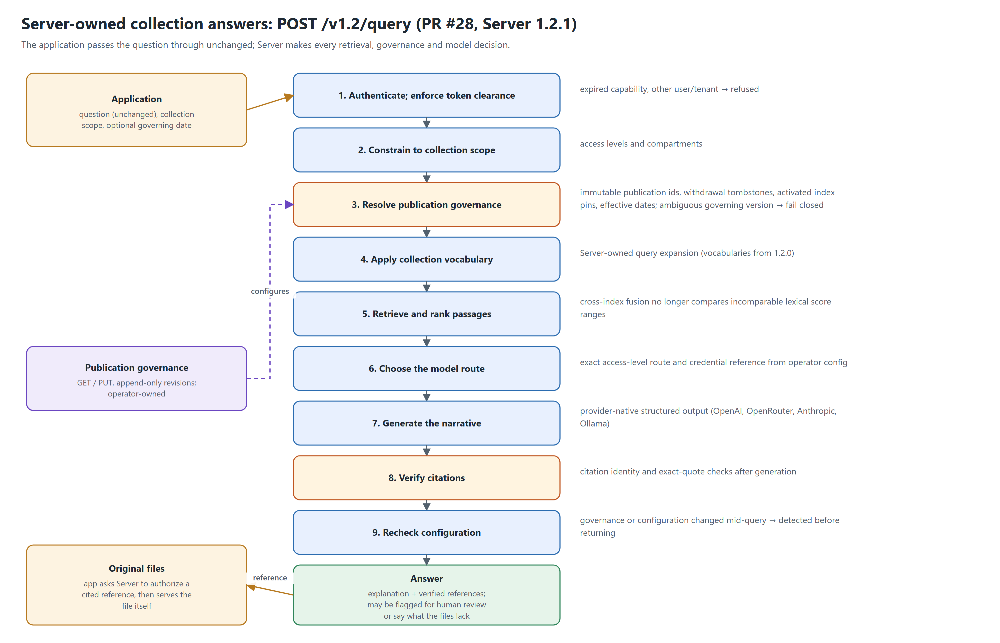

### [#29](https://github.com/iokaio/munarium/pull/29) Document signed Server 1.2.1 publication and rollback — merged 2026-09-14

- **What:** recorded the certified 1.2.1 image built from merged source `c638a8e`: OCI
  index and per-architecture digests, public signature verification, and a tested
  1.2.0 → 1.2.1 → restored-1.2.0 rollback. Stable promotion happened that same day.
- **Why:** close out the release. The image is not rebuilt from the documentation commit.
- **Diagram:** covered by the release-path diagram under #16.

### [#30](https://github.com/iokaio/munarium/pull/30) Align repository documentation with Server 1.2.1 — merged 2026-09-15

- **What:** 26 Markdown files: SDK targets, REST/gRPC guidance, collection queries,
  publication governance, authorization, provider routing, token budgets, and
  migration/rollback. Architecture, operations and changelog coverage were refreshed. The
  developer guide's route table was regenerated to restore corrupted Unicode characters.
- **Why:** 14 September changed a lot of surface area; the docs had to catch up.
- **Diagram:** no.

### [#31](https://github.com/iokaio/munarium/pull/31) Add manual clientbuild workflow for registry publication — merged 2026-09-15

- **What:** `.github/workflows/clientbuild.yml`, `workflow_dispatch` only.
  - One family per run (`server-clients`, `matrix-clients`, `server-crates`).
  - Every registry switch defaults to off, so an unticked run is a rehearsal: it builds every
    package, license-checks the built artifacts, and refuses versions that already exist.
  - Publish jobs run in a `release` environment (main only, required reviewer).
  - Versions come from the manifests via `compatibility.json`, never from workflow input.
  - Credentials: NuGet and PyPI via OIDC trusted publishing; crates.io by token until each
    crate exists; Maven Central by a portal token with in-job signing.
- **Why:** packages had registry metadata but no publication path.
- **Takeaways:** publication is deliberate and rehearsable, and it is kept separate from the
  automatic CI gates. The PR itself flagged the stale proto pin that #32 fixed.
- **Diagram:** yes, the release train (covers #31–#37).
  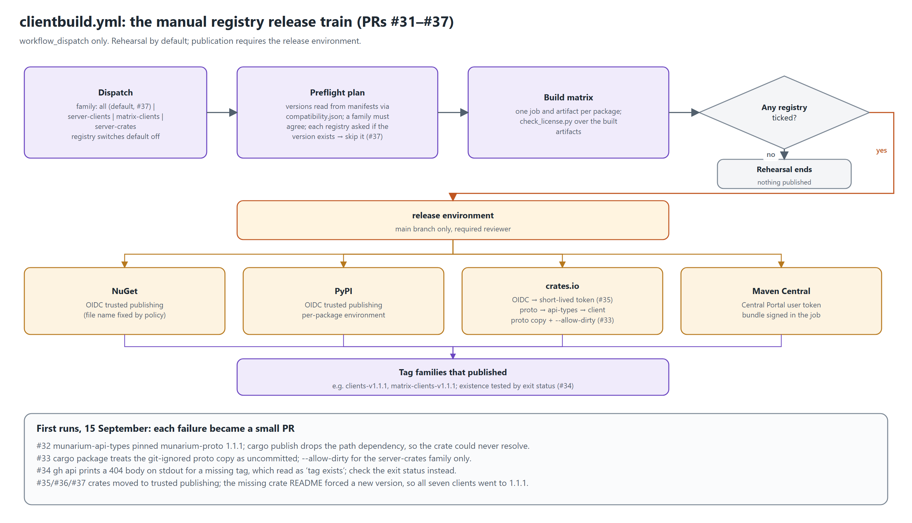

### [#32](https://github.com/iokaio/munarium/pull/32) Pin munarium-api-types to the munarium-proto version it ships with — merged 2026-09-15

- **What / why:** `munarium-api-types` declared `munarium-proto` at 1.1.1 while the
  workspace was at 1.2.1. Locally the path dependency wins, but `cargo publish` strips the
  path and resolves from crates.io, where the required 1.1.1 was absent; the release train published 1.2.1. One-line fix.
- **Takeaway:** path dependencies hide version pins; the registry is the real test.
- **Diagram:** in the clientbuild diagram.

### [#33](https://github.com/iokaio/munarium/pull/33) Allow the proto copy when packaging the wire crates — merged 2026-09-15

- **What / why:** the first `server-crates` run failed: `cargo package` reports files
  matched by the crate's `include` list as uncommitted even if they are git-ignored.
  `--allow-dirty` now applies to the `server-crates` family only, so a dirty tree still
  fails the client family. `munarium-client` also inherits the workspace `repository`.
- **Diagram:** in the clientbuild diagram.

### [#34](https://github.com/iokaio/munarium/pull/34) Test tag existence by exit status, not output — merged 2026-09-15

- **What / why:** both wire crates published, then tagging failed because `gh api` prints
  a 404 body on stdout for a missing tag, and "non-empty output" was read as "exists". The
  check now uses the exit status.
- **Takeaway:** the same class of bug as PowerShell swallowing native failures; #46 returns
  to it for validation.
- **Diagram:** in the clientbuild diagram.

### [#35](https://github.com/iokaio/munarium/pull/35) Publish crates through crates.io trusted publishing — merged 2026-09-15

- **What / why:** once all three crates existed, `publish-crates` switched to OIDC via
  `rust-lang/crates-io-auth-action` (pinned v1.0.5), which gets a short-lived token and
  revokes it at job end. The long-lived `CARGO_REGISTRY_TOKEN` became unnecessary. A brand
  new crate still needs a one-time token publish.
- **Diagram:** in the clientbuild diagram.

### [#36](https://github.com/iokaio/munarium/pull/36) Ship the Rust client README in the crate — merged 2026-09-15

- **What / why:** crates.io showed no README for `munarium-client` 1.1.0, because cargo
  auto-detects a README only in the crate's own directory. Added `readme = "../README.md"`.
  A published version cannot be replaced, so the fix needs a new version.
- **Diagram:** no.

### [#37](https://github.com/iokaio/munarium/pull/37) Release all clients 1.1.1 with the crate README — merged 2026-09-15

- **What**
  - All seven client manifests moved to 1.1.1 (four Server, three Matrix), so one number
    names one release across the registries. No API change.
  - `clientbuild.yml` gained an `all` family (now the default). Preflight asks each registry
    whether a version exists and skips it with a notice, so re-runs are safe. Build and
    publish jobs became per-package matrices; tags are created only for families that
    published something.
  - The client READMEs now show registry install lines, with absolute links so they
    resolve on crates.io.
- **Why:** #36's fix could only ship in a new version, and the workflow requires a family
  to agree on one version.
- **Takeaway:** 15 September is the first registry release of the client libraries.
- **Diagram:** in the clientbuild diagram.

### [#38](https://github.com/iokaio/munarium/pull/38) Client package documentation updates — merged 2026-09-15

- **What:** README refresh across all client packages and the compatibility/errors concept
  page, following publication. **Diagram:** no.

### [#39](https://github.com/iokaio/munarium/pull/39) Update Server docs for published client packages — merged 2026-09-16

- **What:** `server/CONTAINER.md` and `server/README.md` now describe registry
  availability and link the four Server packages directly. **Diagram:** no.

---

## Era 4 — CI and merge policy (18–23 September)

### [#40](https://github.com/iokaio/munarium/pull/40) ci: use standard runners and run full suites on demand — merged 2026-09-18

- **What**
  - All jobs moved to `ubuntu-latest`, removing 16 custom 8-core selections and the runner
    group.
  - Server, Matrix, clients and contract workflows became manual-dispatch only. DCO and
    hygiene stayed automatic (hygiene also gained a workflow-syntax check).
  - Published matching `AGENTS.md` and `CLAUDE.md`, and required local evidence in PRs.
- **Why:** cut repeated hosted build work and use standard runners in a public repository.
- **Diagram:** no. The change is a policy, not a mechanism.

### [#41](https://github.com/iokaio/munarium/pull/41) ci: restore automatic suites and encourage focused local tests — merged 2026-09-18

- **What:** reverted #40's trigger change about 40 minutes after it merged. Full suites run
  automatically again, with standard runners retained. The agent instructions now
  *encourage* focused local checks while explicitly keeping automatic CI.
- **Why:** moving required coverage to manual dispatch meant a green PR no longer implied
  the suites had run.
- **Takeaway for architects:** the settled rule is "local checks supplement CI; they never
  replace it". The VCP roadmap later records this as R05 (preserve automatic CI) and P16
  (shared gate definitions only after demonstrated equivalence).
- **Diagram:** no.

### [#42](https://github.com/iokaio/munarium/pull/42) docs: prevent stale PRs and invalid merge methods — merged 2026-09-23

- **What:** `AGENTS.md`/`CLAUDE.md` guidance: start from current main, review overlapping
  changes, treat CI success and mergeability as different things, revalidate conflict
  resolutions, default to squash per `CONTRIBUTING.md`, check branch rules, keep DCO
  sign-offs, and bind merges to the reviewed commit.
- **Why:** a passing PR can still conflict with newer work, and repository policy can
  reject a merge method.
- **Note:** opened 18 September, merged 23 September after a refresh merge. #44 was
  rebased onto it.
- **Diagram:** no.

---

## Era 5 — Community and VCP lessons (21–24 September)

### [#43](https://github.com/iokaio/munarium/pull/43) docs: invite readers to the Ioka Discord server — merged 2026-09-21

- **What:** three-line README addition. **Diagram:** no.

### [#44](https://github.com/iokaio/munarium/pull/44) Preserve provider usage certainty during budget settlement — merged 2026-09-23

- **What**
  - Complete observed usage settles to its checked sum, including an explicit zero.
    Missing, partial, malformed or legacy-unverified usage settles to at least the
    reservation and the known subtotal.
  - Added defaulted detailed provider methods; existing response structs and required trait
    methods are unchanged. Ollama keeps its strict count requirement.
  - Checked budget arithmetic and PostgreSQL integer conversions. Tests cover provider
    contracts, legacy implementations, duplicate settlement, bounds, and PostgreSQL reopen.
- **Why:** downstream VCP use showed that a successful hosted completion with absent usage
  settled its reservation to zero, which under-counted spend.
- **Constraints recorded:** no migration or wire change. Historical rows are unchanged.
  Every accounting writer must be upgraded before the behavior is uniform across replicas.
  Conservative charges are not a strict upper bound.
- **Files:** `munarium-core/src/provider.rs`, `budget.rs`, `munarium-providers/src/lib.rs`,
  `munarium-store-mem/src/budget.rs`, `munarium-store-pg/src/budget.rs`,
  `providers_usage_tests.rs`.
- **Diagram:** yes, the settlement decision with worked examples.
  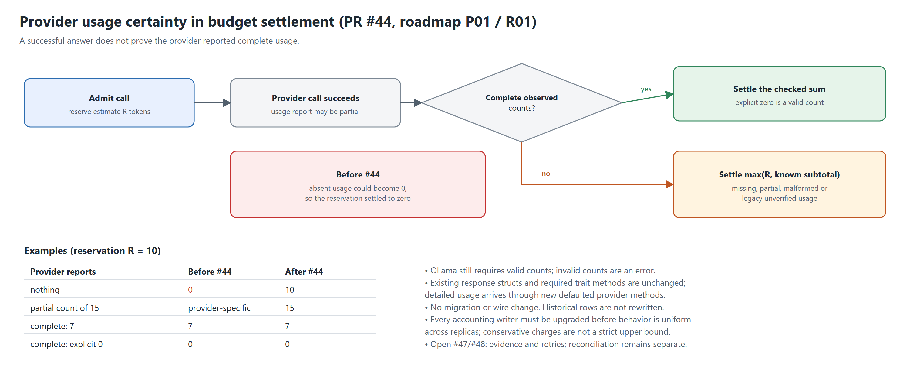

### [#45](https://github.com/iokaio/munarium/pull/45) docs: publish Server lessons and implementation roadmap — merged 2026-09-23

- **What**
  - Published [lessons-from-vcp.md](../lessons-from-vcp.md) (recommendations) and
    [lessons-from-vcp-impl.md](../lessons-from-vcp-impl.md) (plan). Stable IDs R01–R34 map to
    delivery slices P01–P16, with dependencies, owner decisions D1–D8, regression matrices and
    rollout criteria.
  - The companion analysis was rewritten for public readers using only repository-local
    sources. External operational history, private measurements and workstation paths were
    excluded.
  - Fixed a test race introduced by #44: the zero-age sweep fixture swept other tests'
    reservations. It now uses a temporary table on one dedicated connection, with a
    deterministic regression check.
- **Why:** turn downstream experience into a public, reviewable engineering agenda without
  making downstream performance or productivity claims.
- **Takeaway for VCP contributors:** start here. Recheck each finding against current source
  before fixing it; a defect you cannot reproduce stays an investigation.
- **Diagram:** yes, the slice dependency graph with merged status through #46 and open work #47–#49.
  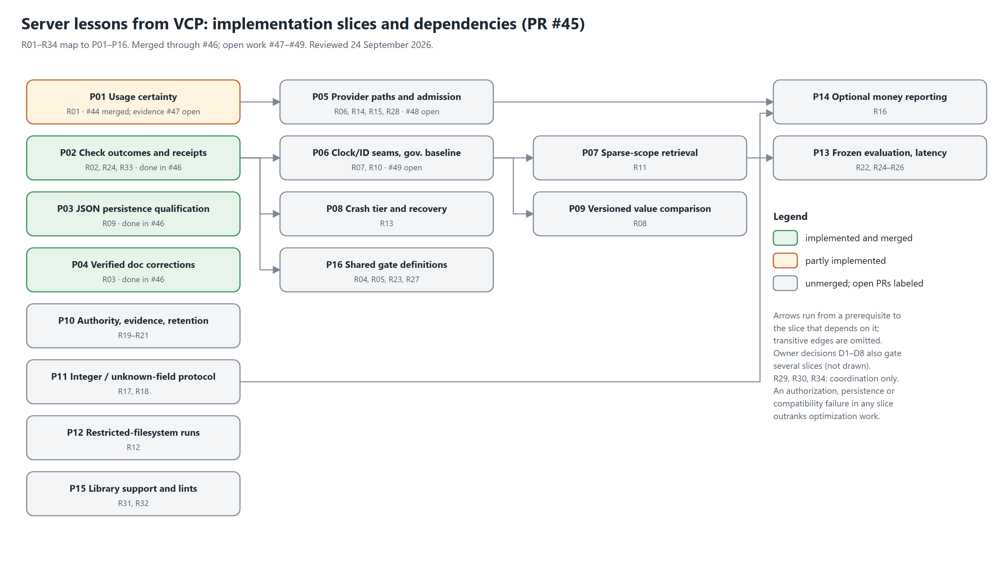

### [#46](https://github.com/iokaio/munarium/pull/46) Make validation outcomes truthful and qualify JSON persistence — merged 2026-09-24

- **What (P02, validation)**
  - `server/tools/validation.ps1` and `validation-tiers.ps1` now drive `gates.ps1` and
    `test.ps1` (−415 and −222 lines respectively).
  - Each selected step records `passed`, `failed` or `not_run` with a reason; unselected
    tiers are `not_requested`. Exit codes are 0 (all passed), 1 (any failure) and 3
    (coverage incomplete or source changed), with failures taking precedence.
  - JSON receipts carry source and tool identity, pre/post input hashes, resource ownership
    and a completion marker. Cleanup touches only resources the run created. Receipts are
    verified by `tools/check_validation_receipt.py` against an expected run id.
- **What (P03, JSON persistence)**
  - `tools/test-json-features.ps1` qualifies default and arbitrary-precision `serde_json`
    across DTOs, PostgreSQL write/reopen, authoring and sealed artifacts, reading artifacts in
    both cross-feature directions against independent old-data fixtures.
  - Fixed literal marker keys being misread as numbers, JSON numbers becoming marker objects
    in generated YAML, and PowerShell null environment removal. Stored formats and migrations
    are unchanged.
- **What (P04):** verified corrections to provider, architecture, release and validation
  docs; new [validation guide](../guides/validation.md).
- **Why:** a green process exit did not show what had actually run. Missing prerequisites,
  early returns and swallowed native failures could look like passes.
- **Diagram:** yes, outcomes, exit precedence and receipt lifecycle.
  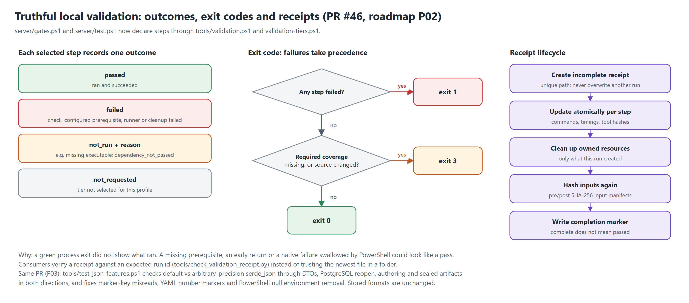

---

## Open follow-up work — reviewed 24 September 2026

These three PRs are stacked in sequence and remain **open, not merged** at this
review. Their proposed behavior is not part of the merged baseline above.

| Slice | Open PR and scope | Remaining boundary |
|---|---|---|
| P01 | [#47: durable usage evidence](https://github.com/iokaio/munarium/pull/47): original reservations, accounted units, observed counts and quality; nullable legacy evidence; memory/PostgreSQL parity and upgrade tests. Also updates P02–P04 to reflect #46. | Late reconciliation remains separate. |
| P05 | [#48: dispatch inventory and retry diagnostics](https://github.com/iokaio/munarium/pull/48): provider accounting inventory, sequential attempt events, checked retry ceiling, scripted retries and cancellation. | Broader caps and diagnostic access still require D1/D7 decisions. |
| P06 | [#49: deterministic governance baseline](https://github.com/iokaio/munarium/pull/49): injectable clocks/IDs with existing constructors preserved; separate gating, snapshot loading, serialization and growing-history write measurements. | Measurements describe the recorded local fixture, not deployment capacity. |

## Threads to develop in the full history

1. **Contracts are generated and drift-checked.** Starts in #1 (protos, OpenAPI, vendored
   Matrix contract), extended by #25/#28 (one inventory feeding REST, gRPC and four SDKs).
   Related roadmap work: P11 (integers, unknown fields).
2. **Governance lives in the Server.** #1 (ledger, disputed claims), #21 (validate before
   spending), #25 (vocabularies), #28 (query, publication governance, operator-owned model
   routes). Applications supply questions and serve files; the Server decides.
3. **Release honesty.** Immutable candidates, exact-image qualification, same-digest
   promotion, rehearsed rollback, and "a candidate is not a release" (#16, #20, #26, #28,
   #29). Mirrored for packages in the clientbuild train (#31–#37).
4. **Evidence over assertion.** Docs execution (#16, #17), dated records (#22), named skips
   (#23), "not run is not passed" (#46), and the settled CI rule from #40/#41.
5. **Silent zero and silent success.** #34 (404 body read as success), #44 (missing usage
   read as zero), #46 (swallowed native failures read as passes). The same failure mode
   three times, with the same answer: represent uncertainty explicitly.
6. **Compatibility by construction.** Additive migrations (0032–0034), wire N/N−1, backup
   required for rollback, all writers upgraded before behavior changes (#44).
7. **Tooling provenance.** Each PR's disclosure section records AI-tool assistance: Claude
   Code for #1 and the clientbuild/publication series #31–#37 (and part of #24); OpenAI
   Codex for most other PRs from #16 onward. Several disclosures explicitly leave human
   review and contributor attestations pending. A disclosure is not proof that review
   occurred; preserve that distinction when describing DCO and provenance.

## Open questions for the full history

- #40 → #41: the descriptions record the change and its reversal, not the discussion. Ask
  the maintainer what prompted the reversal before writing that section.
- Issues #2–#15 are referenced only where PRs close them (#8 Ollama, #15 lab). Decide
  whether the full history should cover issues too.
- Keep merged status through #46 separate from the open work below. Update each slice
  only after its PR merges; record release publication separately.
